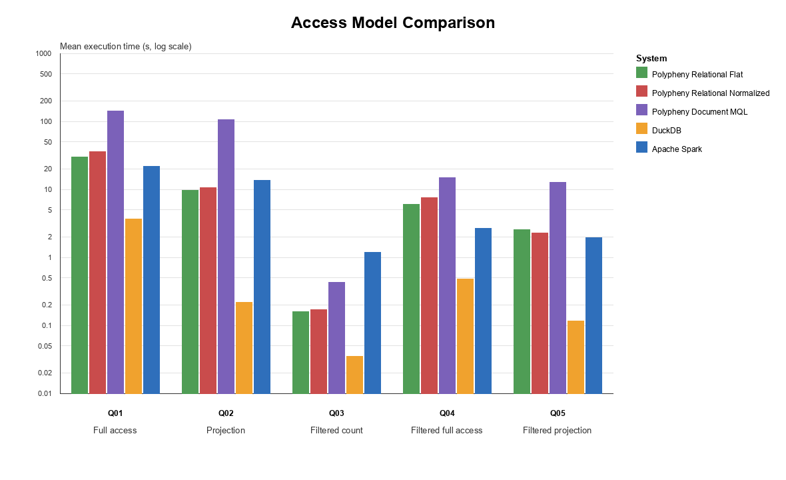

# Access Model Comparison - Benchmark Analysis

## Results Plot


## Interpretation

### General
- The access model comparison run completed successfully for all systems. 
- Every query has `5/5` successful measured runs
- Result row counts match across Polypheny relational flat, Polypheny relational normalized, Polypheny document
MQL, DuckDB, and Apache Spark.
- Standard deviations remain within 12.4% of the corresponding mean runtimes, indicating generally stable repeated measurements.
- Exploratory Welch tests use the five existing measurements per group and Holm-adjusted p-values; non-significant results are treated as insufficient evidence of a difference, not as proof of equal performance.


### Main Findings

- DuckDB is fastest for all five access-pattern queries, and its differences from both Polypheny relational modes are statistically significant after Holm adjustment.
- Polypheny relational flat and normalized modes remain in the same performance range. The flat mode is significantly faster for the full-record queries Q01 and Q04 (Holm-adjusted `p=0.0065` and `p=0.0012`), while the five measurements do not establish a significant difference for Q02, Q03, or Q05 (`p=0.3950`).

- Normalized mode is slower for full-record access because it adds and materializes a synthetic row identifier for every record. This produces one additional result column and requires a binding-aware row-extraction path. When the synthetic identifier is not returned, the current five-run samples do not establish a performance difference between the relational modes.

- MQL (Polypheny Document) is slower than Polypheny relational because of document materialization.

- Projection consistently improves performance across all tested systems. In both the unfiltered case (Q02 compared with Q01) and the filtered case (Q05 compared with Q04), queries that return only selected fields execute faster than queries that return full records. This indicates that reducing the number of retrieved columns lowers the amount of data that must be read, transferred, and materialized, which has a measurable positive effect for relational, document, DuckDB, and Spark-based access paths.

### Spark vs. Other Systems

For Polypheny and DuckDB:

1. The system executes the query.
2. Every result row is transferred through JDBC.
3. The benchmark client reads every field of every row.

For Spark:

1. Spark executes the query.
2. Rows are processed and consumed inside Spark’s executor tasks.
3. Only the final row count is returned to the Python driver.

For a projection returning millions of rows, Polypheny and DuckDB therefore measure:

`query execution + row creation + transfer to client + client consumption`

Spark measures approximately:

`query execution + row creation inside Spark + counting`

Spark does not transfer all projected values to the Python driver. Consequently, it avoids a potentially expensive transfer step and may appear faster than it would in a complete result-retrieval comparison.

This matters mainly for Q01, Q02, Q04, and Q05, which return many rows. It matters much less for Q03 because that query returns only one aggregate row. Spark’s results remain useful for comparing execution, but not for comparing the full cost of delivering every result value to an external client.

## Related Documents

Summary:

```text
plugins/parquet-adapter/benchmarks/results/access_model_comparison/access_model_comparison_tlcp_summary.md
```

Exploratory Welch analysis:

```text
plugins/parquet-adapter/benchmarks/results/access_model_comparison/access_model_comparison_welch_analysis.md
```

Plot:
```text
plugins/parquet-adapter/benchmarks/results/plots/access_model_comparison_tlcp_plot.pdf
plugins/parquet-adapter/benchmarks/results/plots/access_model_comparison_tlcp_plot.png
plugins/parquet-adapter/benchmarks/results/plots/access_model_comparison_tlcp_plot.svg
```
