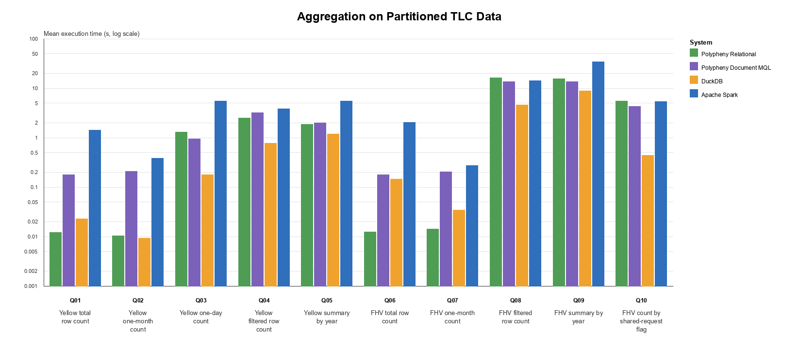

# Aggregation - Benchmark Analysis

## Results Plot


## Interpretation

### General
The aggregation run completed successfully for all evaluated systems. 
All 10 queries completed successfully, with 5/5 successful measured runs per query for every system. 
The result row counts match across Polypheny relational, Polypheny document MQL, DuckDB, and Apache Spark.

### Correctness
Correctness checks confirm consistent aggregation results across systems: all row counts match, while Polypheny relational, DuckDB, and Apache Spark also produce matching grouping keys and COUNT, SUM, MIN, and MAX results within the configured numeric tolerance. Polypheny document MQL produces the same available aggregate values and groups, but Q05, Q09, and Q10 have intentionally different result schemas because the MQL variants omit some count fields and represent grouping keys through _id. These are output-shape differences rather than conflicting aggregation results.

### Main Findings

- Polypheny relational is strongest overall on metadata-oriented count queries: Q01, Q02, Q06, and Q07. It completes these metadata-optimized queries in approximately 10-14 ms, leading Q01, Q06, and Q07 and closely matching DuckDB on Q02. 
- The document adapter also benefits from the metadata optimized count path, although document-processing overhead results in higher runtimes.

DuckDB is fastest for most data-reading aggregation queries. It has the best
runtime for Q03, Q04, Q05, Q08, Q09, and Q10. The gap is especially visible for
Q10, where DuckDB evaluates the shared-request grouping much faster than the
other systems.

The Polypheny document path is competitive with, and sometimes faster than, the
relational path for large data-reading aggregation queries. This is visible for
Q03, Q08, Q09, and Q10. These results show that pushing aggregation into the
Parquet-backed execution path also benefits document workloads when the
aggregate can be expressed over primitive Parquet fields.

Spark has substantial overhead on small metadata-oriented count queries. It
becomes more comparable on the larger high-volume FHV filtered count Q08, but
it remains slower than DuckDB for every aggregation query in this run.

## Interpretation

The query adjustment makes the grouped aggregation comparison much cleaner:
Q05, Q09, and Q10 now use the same grouping level across the SQL systems and
the document adapter. Remaining MQL correctness warnings should therefore be
interpreted as output-shape differences, not as evidence that a different
number of groups was produced.

The benchmark confirms that the Parquet adapter's optimized count path is very
effective, while DuckDB remains the strongest reference point for general
single-node analytical aggregation over Parquet. The document aggregation
results are useful because they show that document queries can still benefit
from relational-style Parquet optimizations when the planner can map document
fields back to Parquet-backed primitive columns.


## Related Documents

Source summary:

```text
plugins/parquet-adapter/benchmarks/results/aggregation/aggregation_summary.md
```

Source correctness comparison:

```text
plugins/parquet-adapter/benchmarks/results/aggregation/aggregation_correctness_summary.md
```
