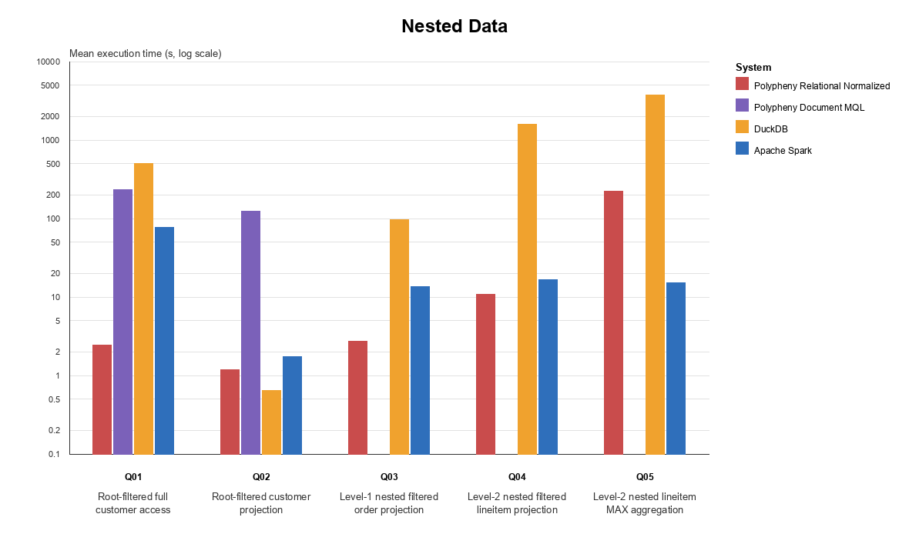
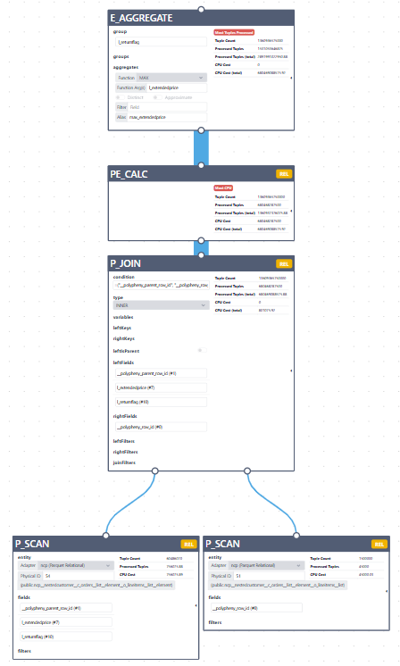

# Nested Data - Benchmark Analysis

## Results Plot



## Interpretation

### General
- Polypheny Relational Normalized, DuckDB, and Apache Spark completed all five queries with `5/5` successful measured runs.
- Polypheny Document MQL completed Q01 and Q02 successfully, while Q03–Q05 could not be executed because the required nested-data operations are not currently supported by the MQL path.
- Where comparable, result row counts were consistent across all successful executions.
- Runtime variability is low to moderate for most successful executions, while DuckDB shows higher variability for Q01, Q04, and Q05.

### Main Findings
- Q01 should not be interpreted as a direct performance comparison. 
DuckDB, Spark, and MQL return the complete nested customer record, including `c_orders` and its lineitems. 
Polypheny Relational Normalized instead returns the root customer fields and a synthetic identifier, while nested records remain accessible through generated child tables.

- Q02 provides the clearest root-level comparison because it explicitly projects only scalar customer fields. 
DuckDB is fastest at 0.64 seconds, followed by Polypheny Relational Normalized at 1.18 seconds and Spark at 1.75 seconds. 
MQL is considerably slower at 122.62 seconds because of document construction and transfer overhead. 
The improvement over Q01 is consistent with avoiding nested payload materialization, although the two queries use different predicates and therefore do not form a controlled projection-only comparison.

- Polypheny Relational Normalized performs best for nested projections. 
It completes Q03 in 2.73 seconds and Q04 in 10.85 seconds, compared with 13.42 and 16.75 seconds for Spark and 96.09 and 1,575.23 seconds for DuckDB. 
Polypheny accesses generated order and lineitem relations using a single parent-child join, 
whereas DuckDB and Spark traverse repeated structures using `UNNEST` or `explode`. 
The deeper traversal in Q04 particularly affects DuckDB.

- Q05 in Polypheny is executed as an aggregation in the Polypheny engine over a join performed by the adapter, because aggregation over nested fields is not supported by the adapter. 
This results in worse performance than Apache Spark.



- DuckDB shows best results when nested structures should not be accessed, otherwise he has the worst performance.


## Related Documents

Summary:

```text
plugins/parquet-adapter/benchmarks/results/nested_data/nested_data_summary.md

```

Plot:
```text
plugins/parquet-adapter/benchmarks/results/plots/nested_data_plot.pdf
plugins/parquet-adapter/benchmarks/results/plots/nested_data_plot.png
plugins/parquet-adapter/benchmarks/results/plots/nested_data_plot.svg
```
