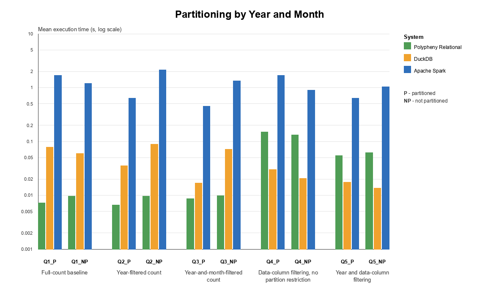

# Partitioning - Benchmark Analysis

## Results Plot


## Interpretation

### General

- The partitioning benchmark completed successfully for all evaluated systems: Polypheny Relational, DuckDB, and Apache Spark.
- All benchmark executions completed successfully (`5/5` successful measured runs for every query).
- Every query produced the expected single aggregate result, confirming consistent execution across all systems.
- The low standard deviations observed across repeated runs indicate stable benchmark measurements.
- Exploratory Welch tests compare the five existing measurements and use Holm-adjusted p-values across the report; non-significant results are not interpreted as evidence that two layouts are equivalent.

## Query Groups

The benchmark consists of five logical query groups. Each query is evaluated on both dataset layouts:

- **RP**: repartitioned Hive-style layout, where `year` and `month` are encoded as directory partitions.
- **UP**: unpartitioned layout, where `year` and `month` are stored as regular columns in the Parquet files.

Queries **Q1–Q3** are evaluated on the `yellow_tripdata` dataset, while **Q4–Q5** use the `green_tripdata` dataset.


## Main Findings

- Q1 serves as the baseline query. Since no predicates are applied to partition columns, both the partitioned and unpartitioned layouts require access to all Parquet files. 
Consequently, Hive partitioning provides no opportunity for partition pruning. The exploratory tests find a layout difference for Polypheny and Spark (Holm-adjusted `p=0.0309` and `p=0.0300`), but the DuckDB difference is not significant after adjustment (`p=0.0699`). Because neither layout can prune files, these differences cannot be attributed to partition pruning and are more likely related to layout-specific implementation overhead.

- Q2 demonstrates the effectiveness of Hive-style partition pruning. 
The query filters on the partition column year, allowing the partitioned layout to skip all directories except those corresponding to the selected year. 
In contrast, the unpartitioned layout must inspect every Parquet file because year is stored as a regular column. 
As a result, all evaluated systems execute the partitioned query substantially faster, with runtime reductions of approximately 31% for Polypheny, 60% for DuckDB, and 70% for Apache Spark.
- The Q2 layout differences are statistically significant for all three systems after Holm adjustment.
- Polypheny shows a smaller difference between the partitioned and unpartitioned layouts in Q2 because the COUNT query is already highly optimized using Parquet metadata.

- Q3 further demonstrates the benefit of Hive-style partitioning. 
By filtering on both partition columns (year and month), the partitioned layout accesses only a single monthly partition, 
while the unpartitioned layout must still inspect all Parquet files. As a result, all evaluated systems have lower mean execution times on the partitioned dataset.
- The lower Q3 means are statistically significant for DuckDB and Spark. For Polypheny, the existing measurements do not establish a significant layout difference (Holm-adjusted `p=0.2720`), consistent with its metadata-based COUNT optimization minimizing the execution cost.
- In the current implementation, Polypheny performs planner-level partition pruning only on the first partition level (year). 
The second partition level (month) is handled within the adapter by filtering the remaining partition directories before reading the Parquet files.

- Q4 query does not filter on the partition columns (year or month), thus Hive-style partition pruning cannot be applied.
Consequently, both the partitioned and unpartitioned layouts must scan all Parquet files. Partitioning provides no measured benefit: the Polypheny difference is not significant (`p=0.1805`), while DuckDB and Spark are significantly slower on the partitioned layout (`p=0.0001` and `p=0.0007`).
These results confirm that partitioning provides a performance benefit only when queries contain predicates on the partition columns.

- Q5 combines a partition predicate with row-level filtering. 
Unlike Q4, the filter on year enables partition pruning, allowing the partitioned layout to skip files belonging to other years. 
Polypheny and Apache Spark have lower mean runtimes on the partitioned dataset. The Spark difference is statistically significant (`p=0.0030`), while the current Polypheny measurements do not establish a significant difference (`p=0.1805`).
DuckDB is significantly faster on the unpartitioned layout (`p=0.0050`), indicating that Hive-style partitioning did not benefit this query in DuckDB under the tested conditions.


## Related Documents

Summary:

```text
plugins/parquet-adapter/benchmarks/results/partitioning/partitioning_summary.md
```

Exploratory Welch analysis:

```text
plugins/parquet-adapter/benchmarks/results/partitioning/partitioning_welch_analysis.md
```

Plot:
```text
plugins/parquet-adapter/benchmarks/results/plots/partitioning_plot.png
plugins/parquet-adapter/benchmarks/results/plots/partitioning_plot.pdf
plugins/parquet-adapter/benchmarks/results/plots/partitioning_plot.svg
```
