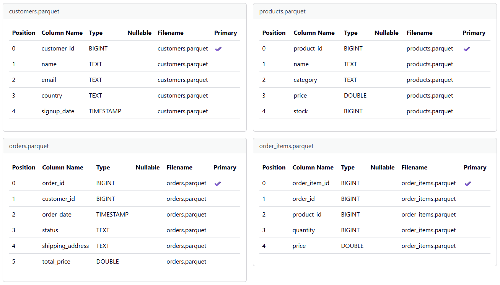
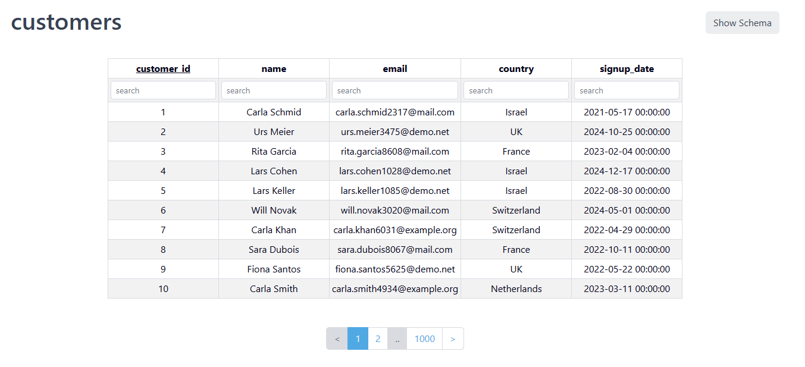
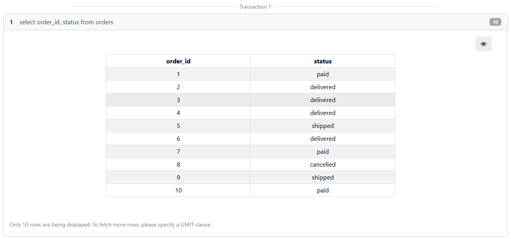
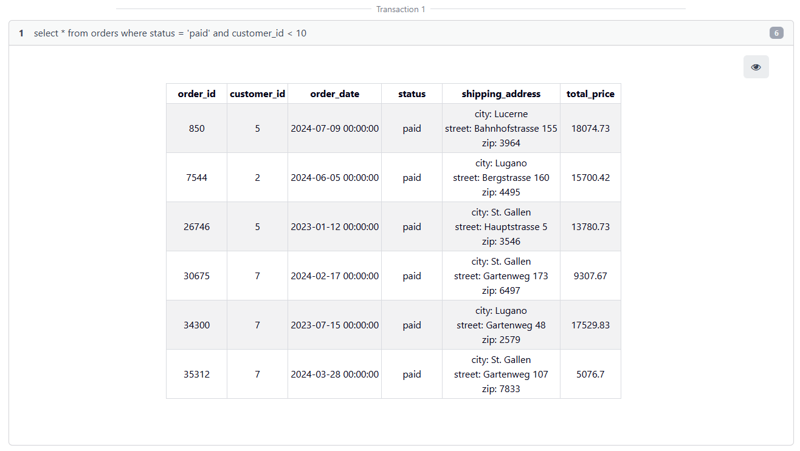

# Parquet Adapter Implementation

---

## Overview

The Parquet adapter exposes `.parquet` files as Polypheny source tables.
At a high level, the adapter is responsible for:
- discovering Parquet files from the configured source location
- extracting relational schema metadata from Parquet file footers
- restoring and registering tables whose data is read from Parquet files
- executing read queries over Parquet data
- applying projection pushdown and supported native predicate pushdown during query execution

The adapter is read-only and supports relational and document source integration.

The following sections describe the architecture, execution flow, package responsibilities, supported query behavior, and current limitations in more detail.

## Build and Integration Changes

1\. To integrate the Parquet adapter as a plugin, the Gradle configuration must include the Parquet module and its dependencies.

Affected files:
- `settings.gradle`
- `gradle.properties`
- `plugins/parquet-adapter/build.gradle`

2\. Optional: To make Parquet the default data source, `PolyphenyDB.java` sets `defaultSourceName` to `parquet`. 
During `restore()`, `Catalog.defaultSource` is populated from the configured adapter state.

## Execution Flow

1. **Plugin registration**
    - **Responsible class:** `ParquetPlugin`
    - Registers the Parquet adapter template during startup.
    - Removes the template during shutdown.
2. **Schema initialization**
    - **Responsible classes:** `AbstractParquetSource`, `ParquetFileDiscovery`, `ParquetTypeConverter`
    - Resolves the configured Parquet directory or file location.
    - Discovers available `.parquet` files.
    - Builds relational table or document collection metadata from Parquet file metadata.
    - Maps Parquet field types to Polypheny types.
    - Normalizes physical table names and column names.
    - Initializes the information page from the extracted column definitions.
3. **Namespace and entity creation**
    - **Responsible classes:** `ParquetNamespace`, `ParquetRelTable`, `ParquetDocument`
    - Creates table or collection wrappers for discovered Parquet files.
    - Registers physical entities in the adapter catalog.
4. **Restore during startup**
    - **Responsible classes:** `ParquetRelationalSource`, `ParquetDocumentSource`, `ParquetNamespace`
    - Recreates relational tables and document collections from persisted adapter state.
    - Re-registers the wrappers in the adapter catalog.
5. **Query entry into the adapter**
    - **Responsible classes:** `ParquetRelScan`, `ParquetDocScan`, `AbstractParquetEnumerator`, `ParquetSourceReader`
    - The query engine resolves the registered Parquet-backed physical entity.
    - Projection and supported filter information are passed into the Parquet execution layer.
    - Rows are read from the Parquet file and converted into Polypheny relational tuples or documents.

## Supported Filter Conditions

The active predicate pushdown path currently supports only simple comparison conditions that can be translated into native Parquet predicates.

Supported operators:
- `=`
- `!=`
- `>`
- `>=`
- `<`
- `<=`

Supported condition shape:
- `column OP literal`
- `column OP dynamic-parameter`

Notes:
- The left-hand side must be a column reference.
- The right-hand side must be a literal value or dynamic parameter.
- Simple casts on either side are unwrapped before translation.
- Only pushdown-safe conditions are translated into adapter-specific filters.
- Unsupported conditions remain outside the Parquet-specific filter flow.

Supported pushdown types:
- `BOOLEAN`: `=` and `!=`
- `INTEGER`, `BIGINT`, `FLOAT`, `DOUBLE`, `DATE`, `TIME`, `TIMESTAMP`: all six comparison operators
- `VARCHAR`, `CHAR`, `TEXT`: `=` and `!=`

Notes:
- Pushdown uses Parquet native filter APIs through `FilterCompat.Filter`.
- Legacy Parquet `INT96` timestamp columns are currently not pushed down.

## Parquet Adapter - Package Structure

### `org.polypheny.db.adapter.parquet`

Contains parquet functionality for Relational and Document data source.

- `ParquetPlugin` - plugin entry point. Registers the relational and document adapter templates after catalog initialization and removes them again during shutdown.

### `org.polypheny.db.adapter.parquet.document`

Document-model integration for exposing Parquet files as read-only Polypheny document collections.

- `ParquetDocumentSource` - document adapter implementation. Owns adapter metadata, performs discovery of Parquet-backed document collections, document restore, and delegation into the document scan APIs.

#### `document.execution`

- `ParquetDocEnumerator` - document runtime enumerator. Reads Parquet rows and create from each row a single `PolyDocument`.
- `ParquetDocFilterTranslator` - translates supported document filter expressions into shared `ParquetAdapterFilter` instances.
- `ParquetDocValueExtractor` - converts Parquet groups and nested values into Polypheny document values and synthesizes `_id` values when they are missing.

#### `document.planning`

- `ParquetDocFilter` - enumerable filter node used when a document filter can stay inside the Parquet-specific execution path.
- `ParquetDocFilterRule` - planner rule that recognizes supported document filters and rewrites them into `ParquetDocFilter` plus `ParquetDocScan`.
- `ParquetDocScan` - document scan algebra node that builds the enumerable execution call for reading Parquet-backed documents.

#### `document.schema`

- `ParquetDocument` - physical collection wrapper for the document model. Represents one Parquet-backed collection inside Polypheny and connects planning and execution to the source adapter.

### `org.polypheny.db.adapter.parquet.relational`

Relational-model integration for exposing Parquet files as source tables.

- `ParquetRelationalSource` - relational adapter implementation. Manages exported table discovery, schema registration, information-page content, and restore of relational Parquet tables.

#### `relational.execution`

- `ParquetRelEnumerator` - relational runtime enumerator. Reads projected Parquet rows and returns them as relational tuples.
- `ParquetRelFilterTranslator` - converts adapter-level filters into Parquet native predicates for relational scans.
- `ParquetRelValueExtractor` - converts Parquet field values into Polypheny relational values with relational-specific scalar handling.

#### `relational.planning`

- `ParquetRelScan` - relational scan algebra node for Parquet-backed physical tables.
- `ParquetRelScanRule` - planner rule that rewrites compatible scans and projections to the Parquet-specific relational scan node.

#### `relational.schema`

- `ParquetRelTable` - physical table wrapper for the relational model. Exposes the Parquet-backed table to Polypheny and ties the planner, scanner, and adapter metadata together.

### `org.polypheny.db.adapter.parquet.shared`

Shared infrastructure used by both the relational and document adapters.

- `AbstractParquetSource` - common base class for both source types. Handles settings, file discovery, exported schema derivation, information-page setup, name normalization, and shared restore behavior.

#### `shared.execution`

- `AbstractParquetEnumerator` - common enumerator base. Manages row iteration, projection handling, cancellation support, and reader lifecycle for both models.
- `AbstractParquetValueExtractor` - shared conversion base for mapping Parquet primitive and structured values into Polypheny values.
- `ParquetFilterTranslationSupport` - reusable helper for parsing supported Rex predicates and turning them into adapter-level filters.
- `ParquetValueExtractor` - small interface implemented by value extractors that can convert a Parquet field into a `PolyValue`.

#### `shared.io`

- `ParquetSourceReader` - low-level Parquet row-group reader. Opens the file, applies projection and native predicates, and streams groups to the enumerators.
- `ParquetSourceWriter` - low-level Parquet writer used by workflow export. Owns file writer lifecycle, compression handling, and row writing.
- `ParquetFileDiscovery` - locates valid `.parquet` files below the configured source location and filters out unsupported files.

#### `shared.filter`

- `ParquetAdapterFilter` - immutable filter description shared across planning and execution. Carries the target column index, comparison operator, literal value, and optional dynamic parameter index.
- `ParquetNativeFilterBuilder`- creates native Parquet filter predicates for the supported comparison operators and value types.

#### `shared.schema`

- `ParquetNamespace` - namespace helper that creates the correct Parquet-backed physical wrapper for either a relational table or a document collection.
- `ParquetMessageTypeBuilder` - builds Parquet `MessageType` definitions from inferred field schemas for workflow export.
- `ParquetTypeConverter` - converts Parquet schema types and runtime values into the Polypheny type system.
- `ParquetFieldNameNormalizer` - creates normalized filed names

#### `shared.schema.inference`

- `FieldSchema` - internal model for one inferred Parquet field used by workflow export.
- `SchemaState` - accumulates inferred field definitions while sampled workflow input is inspected.
- `ValueKind` - enum describing the logical value categories used during schema inference.
- `ValueSchema` - recursive value-type model used to represent primitive, nested, and repeated Parquet field structures before building the final schema.

#### `shared.util`

- `HadoopConfigurationFactory` - builds Hadoop `Configuration` instances that work correctly inside the plugin classloader environment.

## Schema Mapping Rules

- Table names are derived from Parquet file names and normalized before registration.
- Column names are derived from Parquet field names and normalized before registration.
- Column types are mapped from Parquet schema types to Polypheny types.
- String-like Parquet fields are mapped to `TEXT`.
- Unlike SQL types with fixed length declarations, Parquet does not impose a fixed maximum string length.

## Information Page
The information page displays the following column metadata:

- Position
- Column name
- Type
- Nullable
- Filename
- Primary key flag

The following figure shows an example of the displayed schema information.

## Data Presentation

## Query Projection

## Query Filter

## Workflow Integration

Workflow-specific Parquet extract and load activities are documented separately in:
- `docs/workflow.md`

## Unit Tests
___

To run tests for parquet adapter:
- `.\gradlew.bat :plugins:parquet-adapter:test`

`plugins/parquet-adapter/build.gradle` should contain:
- DBMS as a test dependency
- Polypheny JDBC driver dependency

## `ParquetPluginTest.java`
contains the following tests:
1. `importsAllTablesAndReadsRows()`
2. `parquetSourceIsReadOnly()`
3. `readsExpectedRowsFromCustomers()`
4. `filtersRowsWithWhereClause()`
5. `projectsOnlyRequestedColumns()`
6. `supportsGreaterThanFilter()`
7. `supportsAllComparisonFilterOperations()`
8. `rejectsUpdateOnParquetSource()`
9. `projectsAndFiltersOtherTables()`
10. `returnsNestedShippingAddressAsJSON()`

## `ParquetRelFilterTranslatorTest.java`
contains focused unit tests for predicate translation behavior.

Current test coverage includes:
1. `rejectsInt96TimestampPredicatePushdown()`

