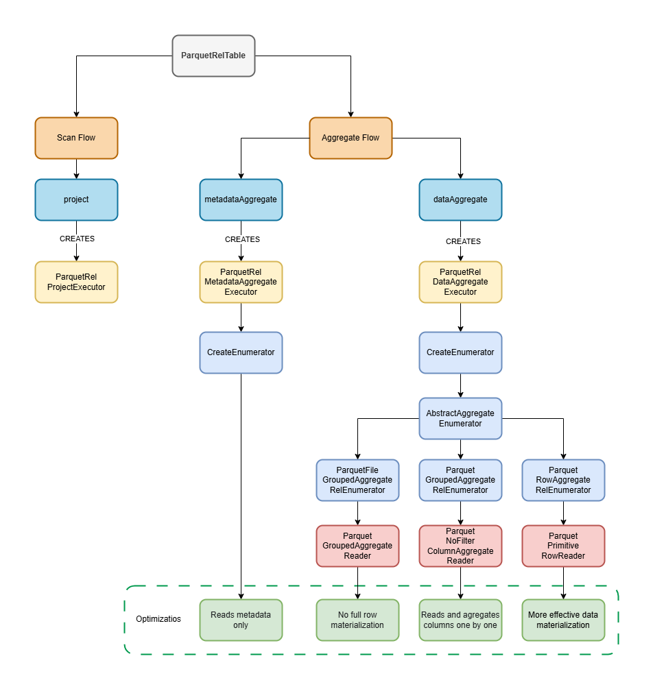

# Aggregation Runtime Flow

Aggregate runtime is shared between relational and document execution through
`ParquetAggregateSource`.

Relational wrappers:

- `ParquetRelDataAggregateExecutor`
- `ParquetRelMetadataAggregateExecutor`

Document wrapper:

- `ParquetDocAggregateExecutor`

Shared executors:

- `ParquetDataAggregateExecutor`
- `ParquetMetadataAggregateExecutor`

## Metadata Aggregate Executor

`ParquetMetadataAggregateExecutor` answers supported aggregate queries from
source-file partition values and Parquet footer statistics.

Flow:

1. Resolve dynamic filter parameters through `ParquetFilterResolver`.
2. Build the source-file evaluator chain:
   `ParquetSourceFilePartitionFilterEvaluator` plus
   `ParquetSourceFileStatisticsFilterEvaluator`.
3. Iterate `ParquetAggregateSource.sourceFiles()`.
4. Skip files proven not to match.
5. Derive group keys from partition values or file-constant physical columns
   through `ParquetConstantColumnResolver`.
6. Accumulate supported `COUNT`, `MIN`, and `MAX` results from metadata.
7. Return result rows as an enumerable.

Metadata mode is selected only when all filters, groups, and aggregate calls can
be answered exactly from file-level information.

## Data Aggregate Executor

`ParquetDataAggregateExecutor` scans data inside the adapter when metadata mode
is not sufficient but the aggregate is still supported.

It chooses among these strategies:

- `ParquetFileGroupedAggregateEnumerator`: file-level grouped aggregate when
  groups and filters are file-constant
- `ParquetGroupedAggregateEnumerator`: grouped aggregate over primitive Parquet
  columns
- `ParquetRowAggregateEnumerator`: row-level fallback over relational enumerator
  output when a faster reader strategy is unavailable

The data executor also uses file pruning before opening source files.

## Fast Paths

Fast paths include:

- scalar or grouped `COUNT(*)` with file-decidable filters
- file-constant partition or physical grouping columns
- no-filter column aggregates over primitive numeric columns
- grouped flat-column aggregates that can be read directly from Parquet pages

## Fallback Behavior

The relational path can fall back to row aggregation when direct aggregate
readers cannot handle a supported aggregate. The document path relies on the
shared aggregate readers and document field mapping; unsupported document
aggregate shapes remain outside the adapter aggregate path.

## Diagram

The original implementation diagram is kept as a supporting image:

