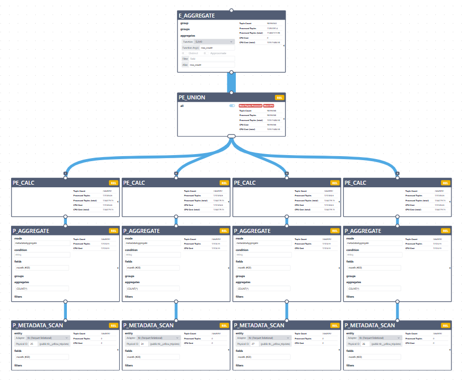
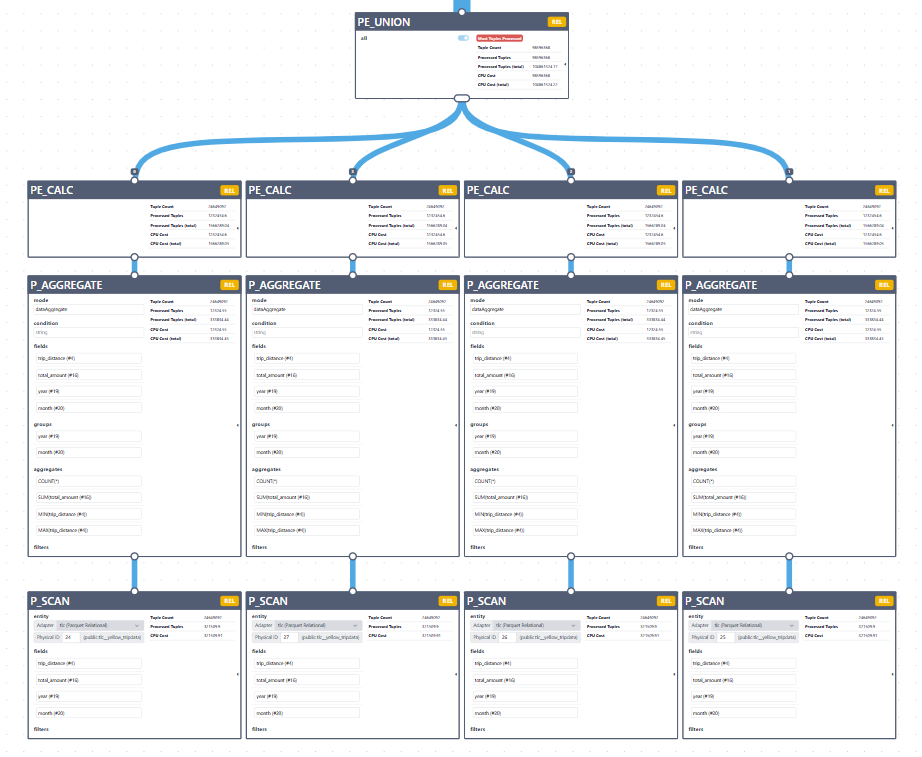

# Aggregation Push-down

## Planner

### Nodes

#### 1. ParquetRelMetadataScan - P_Metadata_Scan

`plugins/parquet-adapter/src/main/java/org/polypheny/db/adapter/parquet/relational/planning/ParquetRelMetadataScan.java`

A planner node for “metadata-only Parquet access,” mainly so aggregate queries, such as COUNT, MIN, MAX, can be planned cheaply without pretending they need to read every row.
Its cost is zero. That tells the optimizer: “this node itself does not scan data rows.”

Aggregates Supported By Metadata:
- COUNT(*)
- COUNT(column)
- MIN(column)
- MAX(column)

#### 2. ParquetRelAggregate - P_Aggregate

`plugins/parquet-adapter/src/main/java/org/polypheny/db/adapter/parquet/relational/planning/ParquetRelAggregate.java`

Planner node that says, “This aggregate can be handled by the Parquet adapter, either cheaply from file metadata or by scanning Parquet data directly.”

represents operations like:
```text
SELECT COUNT(*)
SELECT MIN(price)
SELECT MAX(age)
SELECT category, COUNT(*) GROUP BY category
```

This class decides whether an aggregate can be done in one of two ways:
1. metadataAggregate: use Parquet metadata only, without reading all rows. Example: COUNT(*), MIN(col), MAX(col) may be answerable from Parquet file statistics.
In this case it wraps Scan to ParquetRelMetadataScan

2. dataAggregate: read actual Parquet data and aggregate it.
   This is the fallback when metadata is not enough, but Parquet can still perform the aggregate directly.

The real runtime call is built in `implement`: call "metadataAggregate" or "dataAggregate" depending on the selected mode.

`computeSelfCost` makes this node look very cheap to the optimizer.

#### 3. ParquetEnumerableUnion

Node combines rows from multiple child plans, just like a normal EnumerableUnion, but it has a special class name so planner rules know, 
that this union was already rewritten for Parquet aggregate optimization.
It prevents the same optimization rule from firing again and again.
ParquetEnumerableUnion says: “This union has already been processed for Parquet partial aggregate pushdown.”

### Rules

Rules defined in PatternMatchers.java

#### 1. aggregateOnScan

If there is an aggregate directly above a Parquet scan, try to turn it into a Parquet-native aggregate.

from:

```text
EnumerableAggregate
    EnumerableParquet
        ParquetRelScan
```
to:

```text
EnumerableParquet
    ParquetRelAggregate
        ParquetRelScan
```

#### 2. aggregateOnCalcScan
Like aggregateOnScan, but there is a Calc between the aggregate and the Parquet scan.

from:

```text
EnumerableAggregate COUNT(*)
  EnumerableCalc filter age > 30
    EnumerableParquet
      ParquetRelScan
```
to:

```text
EnumerableParquet
  ParquetRelAggregate COUNT(*)
    ParquetRelScan with filter age > 30
```

#### 3. partialAggregateOnUnion

If we see EnumerableUnion under EnumerableAggregate, and the union is UNION ALL, then push partial aggregates below the union, 
use ParquetEnumerableUnion to union those partial results, then combine those partial results above ParquetEnumerableUnion.

from:

```text
EnumerableAggregate
    EnumerableUnion
        input1
        input2
        input3
```
to:

```text
EnumerableAggregate          <-- final aggregate: calculates aggregate from already computed values
  ParquetEnumerableUnion     <-- marker UNION ALL
    EnumerableAggregate      <-- partial aggregate
      input1
    EnumerableAggregate      <-- partial aggregate
      input2
    EnumerableAggregate      <-- partial aggregate
      input3
```

#### 4. partialAggregateOnCalcUnion

same idea as partialAggregateOnUnion, but there is a Calc between the aggregate and the union.

If we see EnumerableUnion under EnumerableCalc under EnumerableAggregate, and the union is UNION ALL, 
then copy the Calc into each union branch, push partial aggregates below the union, 
use ParquetEnumerableUnion to union those partial results, then combine those partial results above ParquetEnumerableUnion.

Calc should be copied, because the original plan applies the Calc after the union.

from:

```text
EnumerableAggregate
  EnumerableCalc
    EnumerableUnion
      input1
      input2
```

to:

```text
EnumerableAggregate                 <-- combines partial results
  ParquetEnumerableUnion             <-- unions partial results
    EnumerableAggregate              <-- partial aggregate for input1
      EnumerableCalc                 <-- same calc copied here
        input1
    EnumerableAggregate              <-- partial aggregate for input2
      EnumerableCalc                 <-- same calc copied here
        input2
```

### Other Rules relevant files

- `PatternMatchers.java` - defines rewrite rules
- `ParquetRules.java` - collects all those matcher rules into a list
- `ParquetAlgOptRule.java` - wraps them as planner rules
- `ParquetConvention.java` - registers the rules with the planner

## Examples:

```sql
SELECT count(*) AS row_count
FROM tlc__yellow_tripdata;
```




```sql
SELECT
  "year",
  "month",
  count(*) AS trips,
  sum(total_amount) AS gross_amount,
  min(trip_distance) AS min_distance,
  max(trip_distance) AS max_distance
FROM yellow_tripdata
GROUP BY "year", "month"
ORDER BY "year", "month";
```


