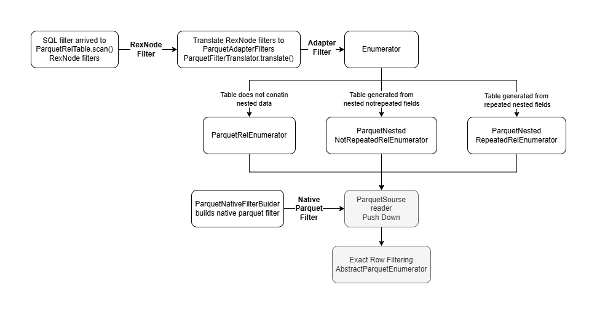

# Parquet Filtering

This document describes the current filtering functionality of the Parquet relational adapter.

## Goal

The adapter applies filtering on two levels:

1. Native Parquet filtering
   - used for row-group pruning
   - skips Parquet row groups before row materialization

2. Enumerator-level filtering
   - used for exact row filtering
   - decides which relational rows are emitted

These two levels are not the same:

- native filtering is an optimization
- enumerator-level filtering is responsible for correctness

## Main Objects

### `ParquetRelTable`

File:

`plugins/parquet-adapter/src/main/java/org/polypheny/db/adapter/parquet/relational/schema/ParquetRelTable.java`

Responsibilities:

- receives SQL filter expressions from Polypheny
- translates supported filters into adapter filters
- resolves dynamic parameters
- resolves Parquet source paths through bindings
- selects the correct enumerator


### `ParquetRelFilterTranslator`

File:

`plugins/parquet-adapter/src/main/java/org/polypheny/db/adapter/parquet/relational/execution/ParquetRelFilterTranslator.java`

Responsibilities:

- parses `RexNode` filter expressions
- accepts only supported operators and value operands
- creates `ParquetAdapterFilter`

### `ParquetFilterTranslationSupport`

File:

`plugins/parquet-adapter/src/main/java/org/polypheny/db/adapter/parquet/shared/execution/ParquetFilterTranslationSupport.java`

Responsibilities:

- helper for parsing supported binary predicates
- unwraps casts
- converts `RexLiteral` and `RexDynamicParam` values into `ParquetAdapterFilter`

### `ParquetAdapterFilter`

File:

`plugins/parquet-adapter/src/main/java/org/polypheny/db/adapter/parquet/shared/filter/ParquetAdapterFilter.java`

Responsibilities:

- immutable filter description shared across scan planning and execution
- can represent:
  - ordinal filter by `columnIndex`
  - path-based filter by `pathElements`

Fields:

- `columnIndex`
  - relational column index
- `pathElements`
  - Parquet source path
- `operator`
  - filter operator
- `polyValue`
  - filter value
- `dynamicParamIndex`
  - dynamic parameter index, if present

Helper:

- `makeNested(int startIndex)`
  - trims a path prefix when a repeated nested scanner already operates inside a deeper group

### `ParquetNativeFilterBuilder`

File:

`plugins/parquet-adapter/src/main/java/org/polypheny/db/adapter/parquet/shared/filter/ParquetNativeFilterBuilder.java`

Responsibilities:

- converts `ParquetAdapterFilter` into native Parquet predicates
- only for cases that can be mapped safely to primitive non-repeated Parquet leaf fields

### `ParquetSourceReader`

File:

`plugins/parquet-adapter/src/main/java/org/polypheny/db/adapter/parquet/shared/io/ParquetSourceReader.java`

Responsibilities:

- opens the Parquet file
- builds the projection schema
- installs native Parquet filter predicates
- reads row groups and rows

### `AbstractParquetEnumerator`

File:

`plugins/parquet-adapter/src/main/java/org/polypheny/db/adapter/parquet/shared/execution/AbstractParquetEnumerator.java`

Responsibilities:

- shared scan lifecycle
- reader ownership
- row queue management
- row expansion
- exact row-level filtering
- current row handling

### `ParquetRelEnumerator`

File:

`plugins/parquet-adapter/src/main/java/org/polypheny/db/adapter/parquet/relational/execution/ParquetRelEnumerator.java`

Responsibilities:

- flat/root ordinal-based scan
- reads projected Parquet fields by ordinal position

### `ParquetNestedNonRepeatedRelEnumerator`

File:

`plugins/parquet-adapter/src/main/java/org/polypheny/db/adapter/parquet/relational/execution/ParquetNestedNonRepeatedRelEnumerator.java`

Responsibilities:

- path-based scan without row expansion
- used when rows still map one-to-one but values must be extracted by Parquet source path

### `ParquetNestedRepeatedRelEnumerator`

File:

`plugins/parquet-adapter/src/main/java/org/polypheny/db/adapter/parquet/relational/execution/ParquetNestedRepeatedRelEnumerator.java`

Responsibilities:

- repeated nested scan
- expands one Parquet root row into multiple relational rows by following the configured table path

### `ParquetPathValueExtractor`

File:

`plugins/parquet-adapter/src/main/java/org/polypheny/db/adapter/parquet/relational/execution/ParquetPathValueExtractor.java`

Responsibilities:

- extracts a relational value by Parquet source path
- used by path-based enumerators

### `ParquetTableBinding` and `ParquetColumnBinding`

Files:

- `plugins/parquet-adapter/src/main/java/org/polypheny/db/adapter/parquet/relational/schema/ParquetTableBinding.java`
- `plugins/parquet-adapter/src/main/java/org/polypheny/db/adapter/parquet/relational/schema/ParquetColumnBinding.java`

Responsibilities:

- connect relational tables and columns back to the Parquet file and Parquet source paths
- make path-based filtering possible for normalized tables

## Full Flow



### Step 1: SQL filter arrives at `ParquetRelTable`

Polypheny calls:

```text
scan( DataContext dataContext, List<RexNode> polyFilters )
```

on `ParquetRelTable`.

At this point filters are still generic `RexNode` expressions.

### Step 2: Supported `RexNode` filters are translated

`ParquetRelTable` uses:

```text
ParquetRelFilterTranslator.translate(...)
```

This produces `ParquetAdapterFilter` only for supported predicates.

Unsupported predicates are left in `polyFilters` and are not pushed into the adapter.

So the adapter only handles filters it explicitly understands.

### Step 3: Dynamic parameters are resolved and Parquet paths are attached

`ParquetRelTable.resolveFilters(...)` transforms translator output into execution-ready filters.

What happens here:

- if a filter uses a dynamic parameter, the actual runtime value is read from `DataContext`
- the table binding is used to map the relational column to its Parquet source path
- a new `ParquetAdapterFilter` is created with:
  - the original `columnIndex`
  - the resolved `pathElements`
  - the concrete value

Example:

```text
SQL filter:
quantity > 2

Relational column:
quantity

Resolved Parquet path:
["items", "quantity"]
```

### Step 4: `ParquetRelTable` selects the enumerator

The scan strategy is chosen as follows:

- `ParquetRelEnumerator`
  - when ordinal scan is safe
- `ParquetNestedNonRepeatedRelEnumerator`
  - when values must be read by path but rows remain one-to-one
- `ParquetNestedRepeatedRelEnumerator`
  - when the table is generated from a repeated nested path

All selected enumerators receive the resolved `ParquetAdapterFilter` list.

### Step 5: `ParquetSourceReader` builds native Parquet predicates

The reader constructor calls:

```text
ParquetNativeFilterBuilder.build( schema, filters )
```

This is the native Parquet optimization layer.

If a filter can be converted safely to a native Parquet predicate, it is added to the reader.
If not, it is ignored at the native level.

Ignored here does not mean ignored completely.
Exact filtering may still happen later inside the enumerator.

### Step 6: `ParquetSourceReader` reads Parquet rows

The reader:

- applies native Parquet row-group filtering if available
- reads projected Parquet rows
- returns `Group` objects

### Step 7: `AbstractParquetEnumerator` performs exact row filtering

`AbstractParquetEnumerator.moveNext()` does the common loop:

- read next Parquet group from the reader
- expand it if needed
- apply exact row-level filtering with `accept(...)`
- extract relational row values

Filtering here is exact for emitted rows.

### Step 8: Enumerator-specific behavior

#### `ParquetRelEnumerator`

- no row expansion
- reads values by ordinal position from the projection schema

#### `ParquetNestedNonRepeatedRelEnumerator`

- no row expansion
- reads values by Parquet source path using `ParquetPathValueExtractor`

#### `ParquetNestedRepeatedRelEnumerator`

- expands one root row into multiple nested groups using `expandRow(...)`
- applies filters to each expanded nested row
- when evaluating path-based filters, it trims the already-resolved table prefix using:

```text
filter.makeNested( tablePath.size() )
```

This allows a filter like:

```text
["items", "product_id"]
```

to become:

```text
["product_id"]
```

when the scanner already operates inside one `items` group.

## Supported Filter Cases

### Supported SQL operators

Supported operators:

- `=`
- `!=`
- `>`
- `>=`
- `<`
- `<=`

These map to:

- `EQUALS`
- `NOT_EQUALS`
- `GREATER_THAN`
- `GREATER_THAN_OR_EQUAL`
- `LESS_THAN`
- `LESS_THAN_OR_EQUAL`

### Supported value operands

Supported right-hand side values:

- literals
- dynamic parameters

Example:

```sql
WHERE total_price > 100
WHERE total_price > ?
```

### Supported data types for translation

`ParquetRelFilterTranslator` currently accepts:

- `BOOLEAN`
- `VARCHAR`
- `CHAR`
- `TEXT`
- `INTEGER`
- `BIGINT`
- `FLOAT`
- `DOUBLE`
- `DATE`
- `TIME`
- `TIMESTAMP`

String-like types only support:

- `=`
- `!=`

Numeric and temporal types support all comparison operators listed above.

### Supported native Parquet pushdown

Native Parquet filtering is supported only for:

- primitive leaf fields
- non-repeated paths

This includes:

- top-level primitive fields addressed by `columnIndex`
- nested primitive non-repeated leaf fields addressed by `pathElements`

Examples that may be pushed down:

```text
order_id = 1001
shipping_address.city = 'Zurich'
total_price > 100
```

### Supported exact enumerator-level filtering

Exact row filtering is supported for:

- flat/root ordinal scans
- path-based non-repeated scans
- repeated nested scans

Examples:

```text
order_id = 1001
shipping_address.city = 'Zurich'
items.product_id = 123
items.discounts.amount > 5
```

Even when a filter cannot be pushed down natively, it may still be applied exactly by the enumerator.

## Unsupported Native Pushdown Cases

These cases are not converted to native Parquet predicates:

- group fields
- repeated paths
- paths that do not resolve to a primitive leaf field
- unsupported value/type/operator combinations

Examples:

```text
shipping_address
items
items.product_id          // repeated path
items.discounts.amount    // repeated path
```

For repeated paths this is intentional:

- Parquet predicate validation does not support repeated columns for native filtering
- exact filtering is still done later by the enumerator

## Unsupported Translation Cases

The adapter does not translate every SQL predicate.

Examples of unsupported translation:

- complex expressions
- predicates with unsupported operators
- predicates that are not simple binary column/value comparisons
- unsupported field types

If translation fails:

- the adapter does not create `ParquetAdapterFilter`
- the filter remains outside the Parquet pushdown path


## Exactness Guarantees

### Native Parquet filtering

Native filtering is only an optimization.

It can:

- skip row groups
- reduce work before row materialization

It must not be treated as the only filtering step for normalized or nested tables.


### Enumerator filtering

Enumerator filtering is the exact filtering stage for emitted relational rows.

This is especially important for:

- path-based non-repeated nested values
- repeated nested child tables


## Examples

### Example 1: Flat/root filter

```sql
SELECT *
FROM parquetrelational1__orders
WHERE order_id = 1001;
```

Flow:

- translated to `ParquetAdapterFilter`
- native Parquet predicate may be created
- `ParquetRelEnumerator` performs exact row filtering


### Example 2: Non-repeated nested filter

```sql
SELECT *
FROM parquetrelational1__orders
WHERE shipping_address_city = 'Zurich';
```

Conceptually the binding resolves the filter to:

```text
["shipping_address", "city"]
```

Flow:

- path-based `ParquetAdapterFilter` is created
- native pushdown may be possible if the path is non-repeated and resolves to a primitive leaf
- `ParquetNestedNonRepeatedRelEnumerator` performs exact row filtering by path


### Example 3: Repeated nested child-table filter

```sql
SELECT *
FROM parquetrelational1__orders__items
WHERE product_id = 123;
```

Binding resolves this to:

```text
["items", "product_id"]
```

Flow:

- native Parquet pushdown is not used because the path is repeated
- `ParquetNestedRepeatedRelEnumerator` expands `items[*]`
- exact filtering is applied to each emitted item row


## Current Design Summary

- `ParquetRelFilterTranslator` decides which SQL predicates can enter the adapter filtering path
- `ParquetRelTable` resolves dynamic values and Parquet source paths
- `ParquetNativeFilterBuilder` provides optional native row-group pruning
- `AbstractParquetEnumerator` provides exact row-level filtering
- repeated nested paths are filtered exactly in the enumerator, not natively in Parquet
