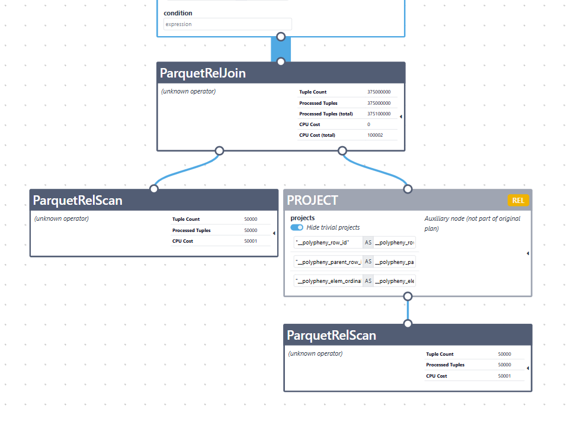
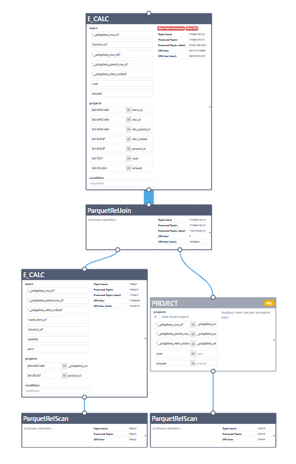

# Adapter Level Joins


## Change Description

The change adds support for executing a limited class of joins inside the Parquet adapter instead of letting Polypheny execute the join above two independent scans. The supported case is a normalized nested-table join where one table represents a parent Parquet group and the other table represents a child repeated group from the same Parquet source.

The purpose is to avoid reading parent and child tables independently and joining them later. The adapter already knows the source path and synthetic key roles for nested generated tables, so it can reconstruct the parent-child relationship while walking the Parquet row structure.

## Supported Joins

This change supports adapter-level joins only for normalized Parquet nested tables that belong to the same Parquet source. It is not a general Parquet join implementation and it is not a general self-join on the same physical table.

The supported case is a direct parent-child join where:

- Both tables have the same `sourceUrl`.
- One table is the direct parent of the other table in the Parquet path hierarchy.
- The child table path is exactly one level below the parent table path.
- The join condition is a single equi-join.
- The parent join key is the generated `PRIMARY_KEY` column.
- The child join key is the generated `PARENT_KEY` column.

The parent is often the root table, but it does not have to be root. A nested table can also be the parent when the child table is directly below it. At runtime the adapter reads from the parent source, resolves the parent path first, then resolves the child path below each parent row.

Supported joins are checked in `ParquetRelJoin.supportedDirection(...)`. The join must be an equi-join with exactly one key on each side, both tables must come from the same source URL, and the keys must match the generated role mapping: parent `PRIMARY_KEY` to child `PARENT_KEY`. The child table path must also be directly below the parent path. Join types accepted by the rule are `INNER`, `LEFT`, `RIGHT`, and `FULL`.

The planner rules can also recognize supported joins when simple row-shaping nodes are between the join and the scan:

- projection-only `Calc` nodes are allowed when they only select or reorder fields
- `EnumerableLimit` nodes below the join may be ignored for join recognition when the SQL limit is still applied above `ParquetRelJoin`

These nodes are not general child execution. They are accepted only when the adapter can preserve the same meaning inside `ParquetRelJoin`.

## Unsupported Joins

For unsupported join shapes, the new adapter-level path should simply not apply.

`ParquetRelJoin.supportedDirection(...)` returns `null` when the join is not supported. Then:

- `ParquetRelJoinRule` does not transform the logical join.
- `ParquetEnumerableJoinRule` does not replace the enumerable join.
- The planner keeps using Polypheny's normal join implementation above the scans.

Unsupported joins:

- Joins between unrelated Parquet tables.
- Joins between different Parquet sources.
- Joins where neither side is the parent of the other.
- Multi-key joins.
- Non-equi joins like <, >, !=
- Join types other than `INNER`, `LEFT`, `RIGHT`, and `FULL`.
- General joins on arbitrary user columns.
- Independent child-side outer join scanning outside the parent path.
- Adapter-executed input limits below the join. `LIMIT` and `OFFSET` must stay above `ParquetRelJoin` and apply to final joined rows.


### Flow

- Rule invocation starts from `ParquetRelScan.register(...)`. When a Parquet scan participates in planning, it registers the existing scan rule and the new join-related rules:

  - `ParquetRelScanRule`
  - `ParquetRelJoinRule`
  - `ParquetEnumerableJoinRule`
  - `ParquetEnumerableFilterJoinRule`
  - `ParquetEnumerableCalcJoinRule`
  

- There are two paths to create the adapter join. 


- `ParquetRelJoinRule` handles a logical join path: 
  - it receives a `LogicalRelJoin`
  - resolves projected `ParquetRelScan` inputs, including projection-only calc wrappers
  - validates the parent-child direction
  - creates `ParquetRelJoin`. 
  

- `ParquetEnumerableJoinRule` handles the later physical path: 
  - if an `EnumerableJoin` has inputs that can be resolved to projected Parquet scans, it performs the same support check and replaces the enumerable join with `ParquetRelJoin`
  - when the optimizer placed an `EnumerableLimit` below the join while the SQL limit remains above the join, the rule can look through that input limit for matching, but the limit is not stored in `ParquetRelJoin` or passed to runtime.


- After `ParquetRelJoin` exists, filters above it can be pushed into the adapter join. 
`ParquetEnumerableFilterJoinRule` matches `EnumerableFilter(ParquetRelJoin)`, translates the filter condition with `ParquetRelFilterTranslator`, and returns `join.withFilters(...)`. 


- `ParquetEnumerableCalcJoinRule` does the same for `EnumerableCalc(ParquetRelJoin)` when the calc contains a condition; it pushes the condition into the join and keeps a projection-only calc above the filtered join.


- At runtime, `ParquetRelJoin.implement(...)` generates enumerable code that calls `leftTable.nestedJoin(dataContext, rightTable, leftFields, rightFields, leftIsParent, emitUnmatchedParents, filters)`. `emitUnmatchedParents` is derived from join type and direction: parent-side outer rows are emitted for parent-preserving `LEFT` or `RIGHT` joins, and for `FULL`. This runtime path preserves unmatched parent rows; it does not perform an independent child-side scan outside the parent path.


- `ParquetRelTable.nestedJoin(...)` is the runtime entry point. It chooses which input is parent and which input is child based on `leftIsParent`, resolves dynamic parameters, maps joined filter column indexes to the correct left or right table column binding, and calls `JoinFiltersSplitter`.


- `JoinFiltersSplitter` classifies filters by the fields they reference. Parent-only filters that can be represented by Parquet paths may become reader filters. Parent-only filters that cannot be reader filters are kept as parent adapter filters. Child-only filters are applied after child expansion. Filters spanning both sides, invalid indexes, or mixed logical conditions become adapter-level joined-row filters.


- `ParquetNestedJoinEnumerator` performs the actual read. It opens the parent source, walks the parent path using inherited nested resolution from `ParquetNestedRepeatedRelEnumerator`, applies parent filters, resolves child groups below each accepted parent, and creates `CombinedGroup` for each joined parent-child row. If a parent has no child and the join type requires preserving unmatched parents, it creates a `CombinedGroup` with a null child side.


- `CombinedGroup` is the bridge between nested Parquet groups and joined row indexes. When the enumerator extracts output values or evaluates filters, the combined group maps each joined field index to the correct parent or child `VirtualGroup`, binding, and table path. This lets the same extraction logic handle both left-parent and right-parent join directions.


- The filter infrastructure was generalized to support this flow. `FiltersContainer` separates reader-level filters from adapter-level filters, and `AbstractParquetEnumerator` now uses that separation when creating `ParquetSourceReader` and when doing row-level checks. Document and normal relational scans were updated to use the same container API so filtering has one common runtime shape across scan and join paths.


## Changed files:

### ParquetRelScan
`plugins/parquet-adapter/src/main/java/org/polypheny/db/adapter/parquet/relational/planning/ParquetRelScan.java`

Registers the new join rules in addition to the scan rule. Also exposes scan fields via Lombok `@Getter`, which is needed by join validation to map join keys back to physical table columns.

### ParquetRelScanRuleSupport
`plugins/parquet-adapter/src/main/java/org/polypheny/db/adapter/parquet/relational/planning/ParquetRelScanRuleSupport.java`

Shared helper used by scan and join planner rules. It finds direct Parquet scans, looks inside planner subsets, and resolves projection-only `Calc` nodes by mapping visible fields back to physical Parquet table columns.

### ParquetRelJoinRule
`plugins/parquet-adapter/src/main/java/org/polypheny/db/adapter/parquet/relational/planning/ParquetRelJoinRule.java`

New file. Converts a `LogicalRelJoin` into `ParquetRelJoin` when both sides can be resolved to projected Parquet scans and `ParquetRelJoin.supportedDirection(...)` accepts the join.

### ParquetEnumerableJoinRule
`plugins/parquet-adapter/src/main/java/org/polypheny/db/adapter/parquet/relational/planning/ParquetEnumerableJoinRule.java`

New file. Rewrites an `EnumerableJoin` over inputs that can be resolved to projected Parquet scans into `ParquetRelJoin` when the join is a supported nested parent-child join. This catches plans where the join has already been converted to enumerable form.

### ParquetRelJoin
`plugins/parquet-adapter/src/main/java/org/polypheny/db/adapter/parquet/relational/planning/ParquetRelJoin.java`

New file. Physical adapter-level join node. It provides supported join validation through `supportedDirection(...)`, stores table metadata, projected fields, join direction, join type, and pushed filters, and generates runtime code that calls `ParquetRelTable.nestedJoin(...)`.

### JoinDirection
`plugins/parquet-adapter/src/main/java/org/polypheny/db/adapter/parquet/relational/planning/JoinDirection.java`

New file. Small value record used by join support checks to remember whether the left input is the parent table. It is returned by `ParquetRelJoin.supportedDirection(...)`.

### ParquetEnumerableFilterJoinRule
`plugins/parquet-adapter/src/main/java/org/polypheny/db/adapter/parquet/relational/planning/ParquetEnumerableFilterJoinRule.java`

New file. Pushes an `EnumerableFilter` above a `ParquetRelJoin` into the adapter join by translating the Rex condition into `ParquetAdapterFilter`.

### ParquetEnumerableCalcJoinRule
`plugins/parquet-adapter/src/main/java/org/polypheny/db/adapter/parquet/relational/planning/ParquetEnumerableCalcJoinRule.java`

New file. Pushes the filter part of an `EnumerableCalc` above a `ParquetRelJoin` into the join while preserving the projection-only calc. Added to support plans where Polypheny represents filter and projection together after the join.

### ParquetRelTable
`plugins/parquet-adapter/src/main/java/org/polypheny/db/adapter/parquet/relational/schema/ParquetRelTable.java`

Adds adapter-level nested join execution through `nestedJoin(...)`. Also exposes binding/source metadata for rule validation, resolves filters with table-specific column bindings, uses `FiltersContainer` for scans, and renames selected binding helper logic to projected binding logic.

### ParquetNestedJoinEnumerator
`plugins/parquet-adapter/src/main/java/org/polypheny/db/adapter/parquet/relational/execution/ParquetNestedJoinEnumerator.java`

New file. Executes supported parent-child joins inside the Parquet adapter. It is created by `ParquetRelTable.nestedJoin()` and reads parent and child rows from the same Parquet source, combines rows into `CombinedGroup`, applies parent and child filters, and emits null child fields for supported outer join cases.

### CombinedGroup
`plugins/parquet-adapter/src/main/java/org/polypheny/db/adapter/parquet/shared/execution/CombinedGroup.java`

New file. Virtual joined row wrapper used by `ParquetNestedJoinEnumerator`. It maps joined output field indexes to either parent or child `VirtualGroup`, supports null-side checks for outer joins, and blocks direct Parquet field access because values are extracted through bindings.

### JoinFiltersSplitter
`plugins/parquet-adapter/src/main/java/org/polypheny/db/adapter/parquet/shared/filter/JoinFiltersSplitter.java`

New file. Splits pushed join filters into parent filters, child filters, adapter filters, and reader filters. Added because filters over joined rows cannot all be pushed to the Parquet reader or to one side safely.

### JoinFiltersContainer
`plugins/parquet-adapter/src/main/java/org/polypheny/db/adapter/parquet/shared/filter/JoinFiltersContainer.java`

New file. Extends `FiltersContainer` with parent-only and child-only filter lists. Used by `ParquetNestedJoinEnumerator` to apply filters at the correct stage of parent-child expansion.

### FiltersContainer
`plugins/parquet-adapter/src/main/java/org/polypheny/db/adapter/parquet/shared/filter/FiltersContainer.java`

New file. Holds two filter lists: adapter-level filters for row checks and reader-level filters for native Parquet predicate pushdown. Added so scans and joins can choose where each filter is safe to apply.

### AbstractParquetEnumerator
`plugins/parquet-adapter/src/main/java/org/polypheny/db/adapter/parquet/shared/execution/AbstractParquetEnumerator.java`

Refactoring and extension. Accepts `FiltersContainer`, passes reader filters to `ParquetSourceReader`, keeps adapter filters for row-level matching, and exposes matching hooks so `ParquetNestedJoinEnumerator` can filter `CombinedGroup` rows.

### ParquetNestedRepeatedRelEnumerator
`plugins/parquet-adapter/src/main/java/org/polypheny/db/adapter/parquet/relational/execution/ParquetNestedRepeatedRelEnumerator.java`

Extended for join reuse. It now accepts `FiltersContainer`, exposes nested path resolution and role-based value extraction to subclasses, and supports an internal constructor that allows root table paths for join execution.

### ParquetAdapterFilter
`plugins/parquet-adapter/src/main/java/org/polypheny/db/adapter/parquet/shared/filter/ParquetAdapterFilter.java`

Adds `toExpression()` so adapter filters, including logical filters and path-aware filters, can be serialized into generated enumerable runtime code.

### ParquetRelEnumerator
`plugins/parquet-adapter/src/main/java/org/polypheny/db/adapter/parquet/relational/execution/ParquetRelEnumerator.java`

Refactoring. Constructor now accepts `FiltersContainer`, passing reader filters to `ParquetSourceReader` and adapter filters to row-level filtering in `AbstractParquetEnumerator`.

### ParquetNestedNonRepeatedRelEnumerator
`plugins/parquet-adapter/src/main/java/org/polypheny/db/adapter/parquet/relational/execution/ParquetNestedNonRepeatedRelEnumerator.java`

Refactoring. Constructor now accepts `FiltersContainer` instead of a raw filter list, so the shared enumerator can distinguish adapter-level filters from reader-level filters.

### ParquetDocScan
`plugins/parquet-adapter/src/main/java/org/polypheny/db/adapter/parquet/document/planning/ParquetDocScan.java`

Refactoring. Uses `ParquetAdapterFilter.toExpression()` instead of building filter expressions locally. This keeps document and relational scans using the same runtime filter serialization logic.

### ParquetDocument
`plugins/parquet-adapter/src/main/java/org/polypheny/db/adapter/parquet/document/schema/ParquetDocument.java`

Refactoring. Wraps resolved document filters in `FiltersContainer.shared(...)` before creating `ParquetDocEnumerator`, so document scans use the new common filter container API.

### ParquetDocEnumerator
`plugins/parquet-adapter/src/main/java/org/polypheny/db/adapter/parquet/document/execution/ParquetDocEnumerator.java`

Refactoring. Use FiltersContainer.

## Examples

### Join - root parent - direct child



### Join - nested parent - direct child



## Convention

In Polypheny planning, a convention describes how an algebra node is implemented physically. Logical algebra says what should happen, while convention says how and where it can be executed.

For example, a logical join only describes the operation:

```text
LogicalRelJoin
  left input
  right input
```

At this point it has `Convention.NONE`, which means it is still a logical plan node and does not yet have a concrete execution implementation.

`EnumerableConvention.INSTANCE` means the node can be executed through Polypheny's enumerable runtime model. In this model, an operator returns rows through an `Enumerable` / `Enumerator`, similar to an iterator:

```text
while (enumerator.moveNext()) {
    row = enumerator.current();
}
```

Enumerable does not mean that there are multiple joins. It means the operator produces result rows one by one. A single join can still be enumerable because it may produce many joined rows.

In this change, `ParquetRelJoinRule` is a converter rule:

```text
LogicalRelJoin.class,
Convention.NONE,
EnumerableConvention.INSTANCE
```

This means: take a logical join and, if it is a supported Parquet parent-child join, convert it into an enumerable physical implementation.

The converted node is:

```text
ParquetRelJoin
```

`ParquetRelJoin` implements `EnumerableAlg`, so it participates in enumerable execution. Its `implement(...)` method generates runtime code that calls:

```text
ParquetRelTable.nestedJoin(...)
```

That method returns:

```text
Enumerable<PolyValue[]>
```

and creates `ParquetNestedJoinEnumerator`, which yields the joined rows one by one.
