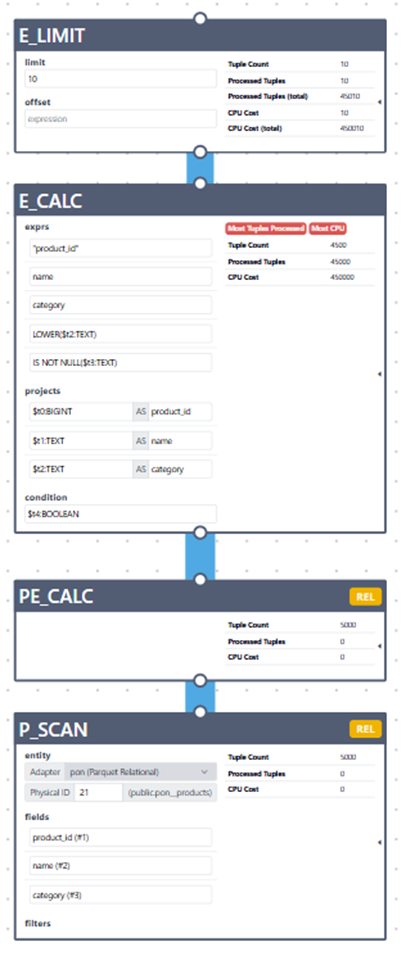
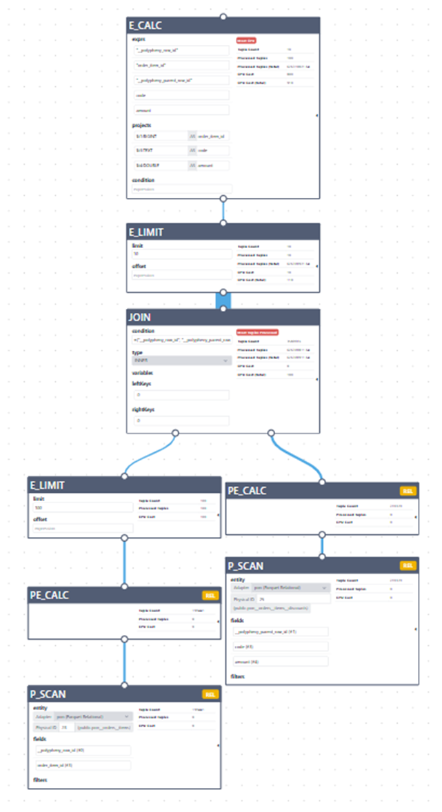
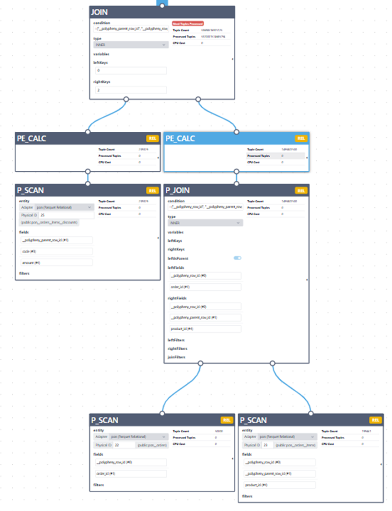
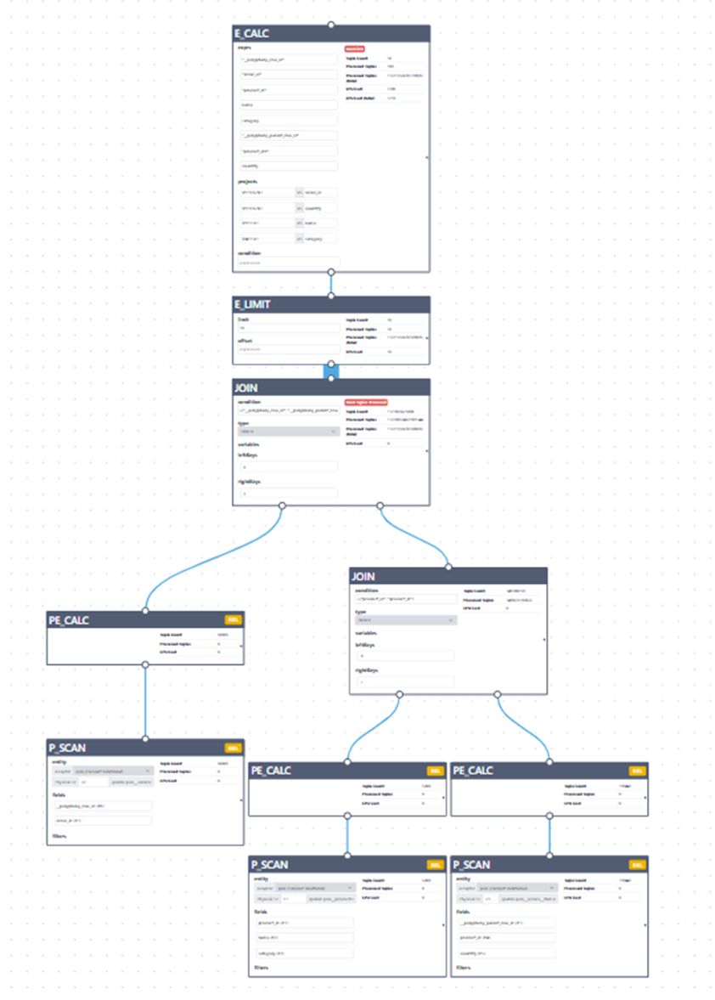
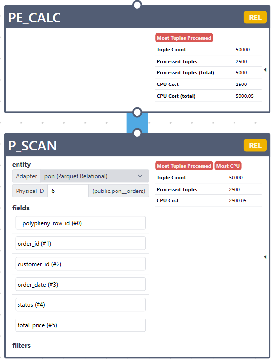
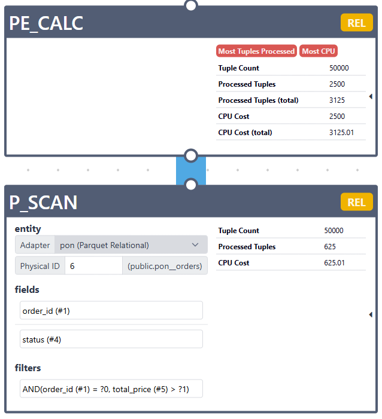
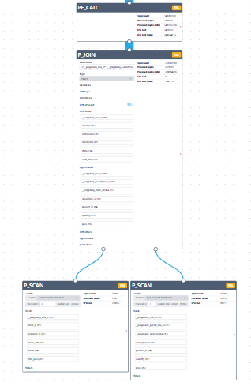
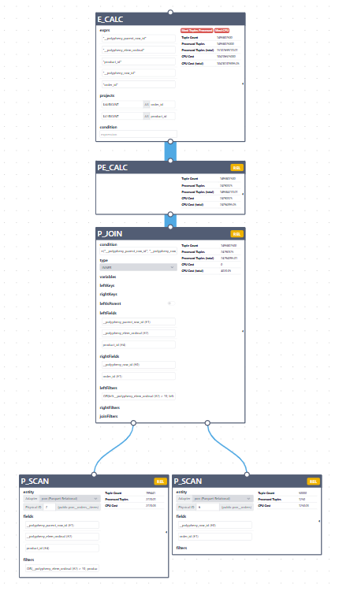

# Adapter Level Joins

## Goal: Perform join on parquet adapter level.

A Parquet adapter-level join is more efficient because it can exploit the physical parent/child layout of the Parquet data.

For normalized nested tables, the relation is:
`child.__polypheny_parent_row_id = parent.__polypheny_row_id`

That relationship comes from one nested Parquet structure. So the adapter can process it closer to how the file is physically stored.


## Benefits of Adepter Level Join
Adepter Level Join is faster because the adapter-level join uses file layout and nested-table semantics, 
while Polypheny-level join treats everything as generic relational rows.

### Polypheny join
- read parent rows
- read child rows
- join outside adapter

### Parquet adapter join:
- read nested parent/child structure
- apply filters while expanding
- return already joined rows

## Supported Joins

We support only joins between virtual tables derived from the same physical parquet file.

## Unsupported Joins

### 1. LOWER(category) filter is not supported

```sql
SELECT product_id, name, category
FROM pon__products
WHERE LOWER(category) IS NOT NULL
LIMIT 10;
```



### 2. LIMIT inside the FROM creates E_LIMIT node under the JOIN

```sql
SELECT i.order_item_id, d.code, d.amount
FROM (
    SELECT __polypheny_row_id, order_item_id
    FROM pon__orders__items
    LIMIT 100
) i
JOIN pon__orders__items__discounts d
    ON d.__polypheny_parent_row_id = i.__polypheny_row_id
LIMIT 10;
```


### 3. Two JOINs - the second join is not supported

join `orders` with `order_items` was done on adapter level

```sql
SELECT o.order_id, i.product_id, d.code, d.amount
FROM pon__orders o
JOIN pon__orders__items i
    ON i.__polypheny_parent_row_id = o.__polypheny_row_id
JOIN pon__orders__items__discounts d
    ON d.__polypheny_parent_row_id = i.__polypheny_row_id
LIMIT 10;
```


### 4. Two JOINs - one join with another physical table

```sql
SELECT o.order_id, i.quantity, p.name, p.category
FROM pon__orders o
JOIN pon__orders__items i
    ON i.__polypheny_parent_row_id = o.__polypheny_row_id
JOIN pon__products p
    ON p.product_id = i.product_id
LIMIT 10;
```


## Main Changes

### 1. Planner Nodes

Two planner nodes were added

#### 1.1. ParquetRelScan
Planner node that represents reading a Parquet-backed table. It's responsibilities:
- Represents a Parquet scan in the plan. It is the Parquet convention version of a table scan.
- Stores projection
- Stores pushed filters
- Defines row type
- Exposes fields and filters in the plan visualization
- Generates execution call: `ParquetRelTable.project(dataContext, fields, filters)`

#### 1.2 ParquetRelJoin
Planner node that represents a join the Parquet adapter can execute itself. It determines:
- If this join be executed inside the Parquet adapter
- the side of parent table
- which projected fields and filters belong to each scan
- which join filters should be applied
- How should this join be executed

#### 1.3 EnumerableParquet
Planner node that converts ParquetScan node from Parquet convention to enumerable convention

### 2. Rules

- `ParquetRules` class creates list of 4 rules
- `PatternMatcher` class describes:
  - what plan shape to match
  - what transformation to run
- `ParquetAlgOptRule` class
  - wraps PatternMatcher as a real AlgOptRule
    so Polypheny planner can register and execute it 
- `PatternMatchers` class contains real rule logic

Four planner rules were added:

#### 2.1 EnumerableParquetRule

Rule that converts a plan from Parquet convention into Enumerable convention.
Parquet-specific plan wrapped as executable enumerable plan.
The Parquet adapter first creates nodes (ParquetRelScan, ParquetRelJoin) in ParquetConvention. But Polypheny ultimately needs an executable plan in: EnumerableConvention
So EnumerableParquetRule adds this wrapper:
- Input convention: ParquetConvention
- Output convention: EnumerableConvention
- Matched node: any AlgNode in ParquetConvention
- Result: EnumerableParquet wrapping that node

#### 2.2 PatternMatchers.attachFieldsAndFiltersToScanUnderCalc

Rule that pushes EnumerableCalc projection/filter into a ParquetRelScan.

- finds Calc above Parquet scan
- extracts simple projection
- extracts supported filter
- stores both on ParquetRelScan
- removes the Calc from this part of the plan

It matches this shape:
```text
EnumerableCalc
  EnumerableParquet
    ParquetRelScan
```
and tries to replace with:
```text
EnumerableParquet
  ParquetRelScan(fields + filters updated)
```
If projection is complex or filter translation fails, the rule does nothing.

#### 2.3 PatternMatchers.joinWithScanOnLeftAndScanOnRight

Rule that converts a generic enumerable join into a Parquet adapter-level join.
- finds generic join between two Parquet scans
- checks if it is a nested parent/child join
- replaces it with ParquetRelJoin
- wraps it back into EnumerableParquet

It matches this shape:
```text
EnumerableJoin
    EnumerableParquet
        ParquetRelScan

    EnumerableParquet
        ParquetRelScan
```
And tries to replace it with:
```text
EnumerableParquet
    ParquetRelJoin
```

#### 2.4 PatternMatchers.attachFilterToJoinUnderCalc

Rule that pushes a filter from a Calc above a ParquetRelJoin into the join node.

- finds Calc above ParquetRelJoin
- extracts supported filter condition
- converts it to ParquetAdapterFilter
- stores it on ParquetRelJoin.joinFilters
- removes that Calc from this part of the plan

It matches this shape:
```text
EnumerableCalc
  EnumerableParquet
    ParquetRelJoin
```
and tries to replace with:
```text
EnumerableParquet
  ParquetRelJoin(joinFilters updated)
```

### 3. Registration of nodes

`ParquetPlugin.registerPolyAlg()` registers:
- EnumerableParquet.class
- ParquetRelScan.class
- ParquetRelJoin.class

### 4. Parquet Convention
 
`ParquetConvention` is the marker that tells the planner: This part of the plan is executable by the Parquet adapter.
It defines a separate planner convention named: "PARQUET"
and says that nodes in this convention must implement: ParquetAlg


## Planner Flow - Query Execution with Join

1. ParquetRelScan.register() called
- All rules from ParquetRules.rules added to Planner

2. ParquetRelTable.nestedJoin() called (if no join - project called)
3. ParquetMultiFileEnumerator created
4. ParquetMultiFileEnumerator performs file pruning
5. ParquetMultiFileEnumerator creates ParquetNestedJoinEnumerator


## Examples of Physical Plans:

### Node Names
- P_SCAN - ParquetRelScan
- PE_CALC - EnumerableParquet
- P_JOIN - ParquetRelJoin

### Rule 1: EnumerableParquetRule
Create Enumerable node PE_CALC above P_SCAN 

No filter, no projection, no join

```sql
SELECT *
FROM pon__orders o;
```


### Rule 2: PatternMatchers.attachFieldsAndFiltersToScanUnderCalc

Pushing down of projection/filter from E_CALC into P_SCAN.

```sql
SELECT o.order_id, o.status
FROM pon__orders o
where o.order_id = 2 and total_price > 10;
```



### Rule 3: PatternMatchers.joinWithScanOnLeftAndScanOnRight

Convert E_JOIN with two P_SCANs under it into P_JOIN.

```sql
SELECT *
FROM pon__orders o
JOIN pon__orders__items i
    ON i.__polypheny_parent_row_id = o.__polypheny_row_id;
```



### Rule 4: PatternMatchers.attachFilterToJoinUnderCalc

Get filters from E_CALC under E_JOIN and push it into the PE_JOIN.

```sql
SELECT o.order_id, i.product_id
FROM pon__orders o
JOIN pon__orders__items i
ON i.__polypheny_parent_row_id = o.__polypheny_row_id
WHERE i.__polypheny_elem_ordinal > 0 or i.product_id = 1;
```


