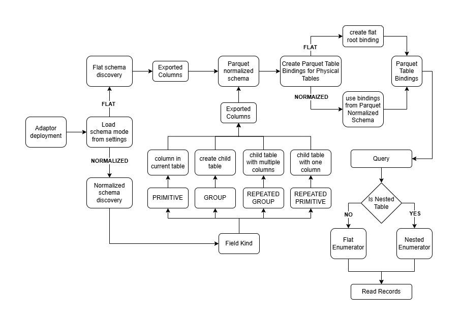
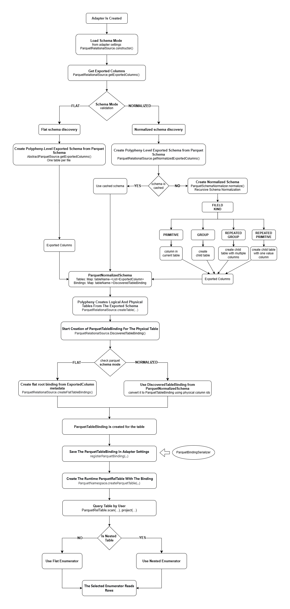

# Relational Schema Normalization

Parquet nested structures are exposed as regular relational tables.
In FLAT mode, each file becomes one table and nested values remain inside the root row.
In NORMALIZED mode, Polypheny reads the Parquet schema and recursively splits it as follows:

- primitive field -> column
- non-repeated group -> child table with 0/1 row per parent
- repeated group -> child table with multiple rows per parent
- repeated primitive field -> child table with one value column and multiple rows per parent

All relational Parquet table names are adapter-prefixed, both flat and normalized.

_Example:_ `parquetrelational1__orders`, not just `orders`. This allows create different adapters for flat and normalized schema modes.

## Example of Parquet shape

```text
orders.parquet
root
|- order_id: int64
|- customer: string
|- items: repeated group
   |- product_id: string
   |- quantity: int32
   |- discounts: repeated group
      |- code: string
      |- amount: decimal
```

## Flat Mode

- Preserve the Parquet file as one table

**_orders_**

| order_id | customer | items                                                                                                                                                         |
|----------|----------|---------------------------------------------------------------------------------------------------------------------------------------------------------------|
| 1001     | Alice    | [{product_id: "A-1", quantity: 2, discounts: [{code: "SUMMER", amount: 5.00}, {code: "VIP", amount: 2.00}]}, {product_id: "B-5", quantity: 1, discounts: []}] |
| 1002     | Bob      | [{product_id: "C-9", quantity: 4, discounts: []}]                                                                                                             |

```text
orders.parquet
-> orders
```

## Normalized Mode

- Split nested structures into generated relational child tables
- NEED TO STORE ADDITIONAL INFORMATION

**_orders_**

| polypheny_row_id | order_id | customer |
|------------------|----------|----------|
| 1                | 1001     | Alice    |
| 2                | 1002     | Bob      |

**_orders__items_**

| polypheny_row_id | polypheny_parent_row_id | polypheny_elem_ordinal | product_id | quantity |
|------------------|-------------------------|------------------------|------------|----------|
| 10               | 1                       | 0                      | A-1        | 2        |
| 11               | 1                       | 1                      | B-5        | 1        |
| 12               | 2                       | 0                      | C-9        | 4        |

**_orders__items__discounts_**

| polypheny_row_id | polypheny_parent_row_id | polypheny_elem_ordinal | code   | amount |
|------------------|-------------------------|------------------------|--------|--------|
| 20               | 10                      | 0                      | SUMMER | 5.00   |
| 21               | 10                      | 1                      | VIP    | 2.00   |

```text
orders.parquet
    -> orders
    -> orders__items
    -> orders__items__discounts
 ```

```sql
SELECT o.order_id, i.product_id, i.quantity
FROM orders o
JOIN orders__items i
  ON i.polypheny_parent_row_id = o.polypheny_row_id;

```

## Example with unique table names

### Flat result

```text
parquetrelational1__orders -> [order_id, customer_id, status, ...]
```

### Normalized result

```text
parquetrelational1__orders -> [order_id, customer_id, status, total_price]
parquetrelational1__orders__items -> [order_item_id, product_id, quantity, price]
parquetrelational1__orders__items__discounts -> [code, amount]
```

## Synthetic Columns

- Normalized tables include visible _synthetic key columns_:
  - polypheny_row_id
  - polypheny_parent_row_id
  - polypheny_elem_ordinal
- Root tables have:
  - polypheny_row_id
- Child tables have:
  - polypheny_row_id
  - polypheny_parent_row_id
  - polypheny_elem_ordinal - for repeated children
- Non-repeated child tables still have:
  - polypheny_parent_row_id
  - polypheny_elem_ordinal is always 0

**_Sql Example:_**

```sql
SELECT o.order_id, i.product_id, i.quantity
FROM parquetrelational1__orders o
JOIN parquetrelational1__orders__items i
  ON i.polypheny_parent_row_id = o.polypheny_row_id;

```

For deeper nesting, the same rule applies at each level. A row in parquetrelational1__orders__items__discounts points to its parent item row, not directly to the root order row:

```sql
SELECT i.product_id, d.code, d.amount
FROM parquetrelational1__orders__items i
JOIN parquetrelational1__orders__items__discounts d
  ON d.polypheny_parent_row_id = i.polypheny_row_id;
```

## BINDINGS

Generated relational tables are virtual: they do not exist as separate Parquet files.
The data still lives in the original Parquet file.
To connect virtual tables with physical Parquet data, we store bindings.
Bindings describe:

- which Parquet file backs each generated table
- which nested path produces the table rows
- which Parquet field path provides each column value
- which synthetic columns are generated by Polypheny

### Example

#### Table Bindings for orders.parquet

| Generated table             | Source Parquet file | Nested path that produces table rows | Parent table      |
|-----------------------------|---------------------|--------------------------------------|-------------------|
| `pn_orders`                 | `orders.parquet`    | root row                             | none              |
| `pn_orders_items`           | `orders.parquet`    | `items[*]`                           | `pn_orders`       |
| `pn_orders_items_discounts` | `orders.parquet`    | `items[*].discounts[*]`              | `pn_orders_items` |

#### Column Bindings for pn_orders_items_discounts

| Generated column          | Source Parquet field path                              | Column role           |
|---------------------------|--------------------------------------------------------|-----------------------|
| `polypheny_row_id`        | generated by Polypheny                                 | synthetic primary key |
| `polypheny_parent_row_id` | generated by Polypheny from parent item row            | synthetic parent key  |
| `polypheny_elem_ordinal`  | generated by Polypheny from repeated discount position | synthetic ordinal     |
| `code`                    | `items.discounts.code`                                 | data                  |
| `amount`                  | `items.discounts.amount`                               | data                  |


## Code Changes

### AbstractParquetSource

`Polypheny-DB\plugins\parquet-adapter\src\main\java\org\polypheny\db\adapter\parquet\shared\AbstractParquetSource.java`

- Adding shared metadata persistence, safer URL handling, and adapter-prefixed table names
- Store Parquet Bindings in adapter settings in persistParquetBindings() function
- Load Parquet Bindings from settings in constructor()
- Prefix is added to the table names to allow deployment multiple Parquet relational adapters over the same files, for example one flat and one normalized, without logical table name collisions - getPrefixTableName() function

### ParquetColumnRole

`Polypheny-DB\plugins\parquet-adapter\src\main\java\org\polypheny\db\adapter\parquet\relational\schema\ParquetColumnRole.java`

- Describes what kind of column a relational Parquet column is inside a ParquetTableBinding
  - DATA - a normal real Parquet value
  - PRIMARY_KEY - synthetic generated row id
  - PARENT_KEY - synthetic reference to the parent generated row
  - ORDINAL - position of a child value inside its parent

### ParquetColumnBinding

`Polypheny-DB\plugins\parquet-adapter\src\main\java\org\polypheny\db\adapter\parquet\relational\schema\ParquetColumnBinding.java`
Metadata object that tells the Parquet scanner for specific Polypheny column, where does its value come from. Used for reading data.
Contains:

- columnId - Polypheny physical column id connected to an actual column in Polypheny's physical table catalog
- columnName - relational column name
- role - ParquetColumnRole - what kind of column this is
- sourcePathElements - the path inside the Parquet schema that should be used to read this column. For example:
  - flat/root column - path: ["order_id"]
  - nested - path: ["shipping_address", "city"]

### ParquetTableBinding

`Polypheny-DB\plugins\parquet-adapter\src\main\java\org\polypheny\db\adapter\parquet\relational\schema\ParquetTableBinding.java`
Table-level metadata, describes the whole table, immutable record
Fields:

- sourceUrl - real Parquet file URL to read from
- parentTableName - generated parent relational table name, or null for root tables
- sourcePathElements - table-level path inside the Parquet file, For root: List.of(), for nested: List.of("items")
- columnsByColumnId - `Map<Long, ParquetColumnBinding>` - maps Polypheny physical column ids to column bindings

Example:

```text
sourceUrl: orders.parquet
parentTableName: parquetrelational1__orders
sourcePathElements: ["items"]

columnPaths:
product_id -> ["items", "product_id"]
quantity   -> ["items", "quantity"]
```

### ParquetUrlResolver

`Polypheny-DB\plugins\parquet-adapter\src\main\java\org\polypheny\db\adapter\parquet\shared\io\ParquetUrlResolver.java`
Utility, Parquet file/directory URL handling

### ParquetSchemaMode

`Polypheny-DB\plugins\parquet-adapter\src\main\java\org\polypheny\db\adapter\parquet\relational\schema\ParquetSchemaMode.java`
User-selectable adapter setting that controls how the Parquet schema:

- FLAT
- NORMALIZED

### ParquetSchemaNormalizer

`Polypheny-DB\plugins\parquet-adapter\src\main\java\org\polypheny\db\adapter\parquet\relational\schema\ParquetSchemaNormalizer.java`
Turns Parquet nested schema into multiple relational tables for normalized mode.
Contains the main normalization logic. It builds ParquetNormalizedSchema with:

- `Map<String, List<ExportedColumn>>` tables
- `Map<String, DiscoveredTableBinding>` bindings

### ParquetNormalizedSchema

`Polypheny-DB\plugins\parquet-adapter\src\main\java\org\polypheny\db\adapter\parquet\relational\schema\ParquetNormalizedSchema.java`
contains normalizes schema information for all tables:

- `Map<String, List<ExportedColumn>>` tables - normalized columns per table name
- `Map<String, DiscoveredTableBinding>` bindings - binding per table name

### DiscoveredTableBinding

`Polypheny-DB\plugins\parquet-adapter\src\main\java\org\polypheny\db\adapter\parquet\relational\schema\DiscoveredTableBinding.java`
temporary discovery metadata before a real ParquetTableBinding created
for ParquetTableBinding we need physical table ids, that are created after normalization step

### ParquetBindingSerializer

`Polypheny-DB\plugins\parquet-adapter\src\main\java\org\polypheny\db\adapter\parquet\relational\schema\ParquetBindingSerializer.java`
Saves and restores ParquetTableBinding metadata through adapter settings.

### AbstractParquetEnumerator

`Polypheny-DB\plugins\parquet-adapter\src\main\java\org\polypheny\db\adapter\parquet\shared\execution\AbstractParquetEnumerator.java`
Shared base for relational scans.

### ParquetNestedRepeatedRelEnumerator

`Polypheny-DB\plugins\parquet-adapter\src\main\java\org\polypheny\db\adapter\parquet\relational\execution\ParquetNestedRepeatedRelEnumerator.java`
Used for tables that do not have their own Parquet file, but are created from a nested group inside a Parquet file.

### ParquetNestedNonRepeatedRelEnumerator

`Polypheny-DB\plugins\parquet-adapter\src\main\java\org\polypheny\db\adapter\parquet\relational\execution\ParquetNestedNonRepeatedRelEnumerator.java`
Used to handle virtual table that was created from nested non-repeated types.

### ParquetRelationalSource

`Polypheny-DB\plugins\parquet-adapter\src\main\java\org\polypheny\db\adapter\parquet\relational\ParquetRelationalSource.java`
changed from simple relational Parquet source that exports one table per file into the controller for flat vs normalized relational Parquet mode.

### ParquetRelTable

`Polypheny-DB\plugins\parquet-adapter\src\main\java\org\polypheny\db\adapter\parquet\relational\schema\ParquetRelTable.java`

`ParquetRelTable` changed from a simple wrapper that always scanned Parquet columns by ordinal into a wrapper that chooses the correct scan strategy based on table binding metadata.

Current scan strategies:

- `ParquetRelEnumerator`
  - used for flat/root tables when relational column positions still match Parquet field positions
  - keeps the original ordinal-based scan behavior

- `ParquetNestedNonRepeatedRelEnumerator`
  - used when rows are still produced one-to-one, but values must be read by Parquet source path instead of ordinal position
  - supports path-based extraction and filtering for non-repeated nested values

- `ParquetNestedRepeatedRelEnumerator`
  - used for generated repeated child tables
  - expands one Parquet root row into multiple relational rows by following the configured table path

`ParquetRelTable` uses `ParquetTableBinding` to decide which scanner to create.
This allows Polypheny to read both flat tables and generated normalized tables from the same original Parquet file.

### ParquetNamespace

`Polypheny-DB\plugins\parquet-adapter\src\main\java\org\polypheny\db\adapter\parquet\shared\schema\ParquetNamespace.java`
Make relational table creation binding-aware.

### ParquetAdapterFilter

`Polypheny-DB\plugins\parquet-adapter\src\main\java\org\polypheny\db\adapter\parquet\shared\filter\ParquetAdapterFilter.java`

`ParquetAdapterFilter` is the shared immutable filter description used during Parquet scan planning and execution.

It can represent filters in two forms:

- ordinal filter
  - uses `columnIndex`
  - used when relational column position still matches Parquet field position

- path-based filter
  - uses `pathElements`
  - used for normalized tables and nested fields, where values must be read by Parquet source path

The helper method `makeNested(int startIndex)` creates a nested version of the same filter by trimming the prefix of the Parquet path.
This is useful when a nested scanner already operates inside a deeper Parquet group and only needs the remaining relative path.

### ParquetNativeFilterBuilder

`Polypheny-DB\plugins\parquet-adapter\src\main\java\org\polypheny\db\adapter\parquet\shared\filter\ParquetNativeFilterBuilder.java`

`ParquetNativeFilterBuilder` creates native Parquet predicates for row-group pruning.

It translates `ParquetAdapterFilter` into Parquet filter expressions when the target field can be mapped safely to a primitive Parquet column.

Native Parquet filtering is only supported for primitive non-repeated leaf fields.

If a filter cannot be pushed down safely, it is ignored at the native Parquet level and must still be applied during row scanning.

This means native filtering is used as an optimization, while exact correctness is preserved by enumerator-level filtering.

## Flow




