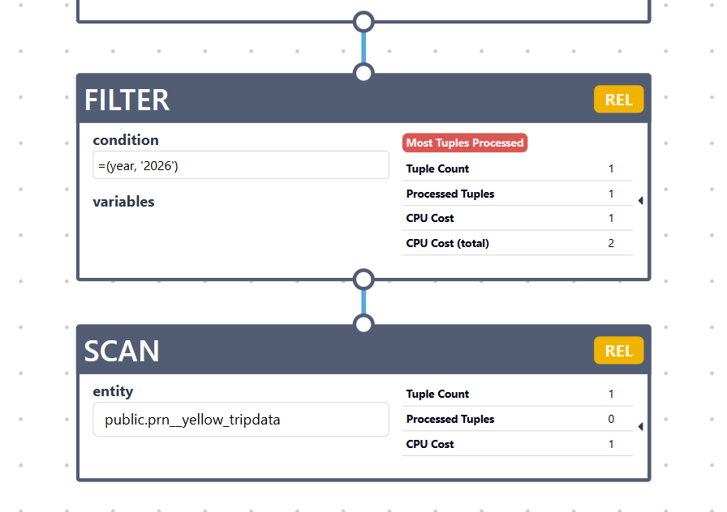

# Partitioning Changed Files

## Discovery and Schema Metadata

### ParquetFileDiscovery.java
`plugins/parquet-adapter/src/main/java/org/polypheny/db/adapter/parquet/shared/io/ParquetFileDiscovery.java`

Discovery layer that converts the physical file/folder layout into logical tables the adapter can create and scan.

### DiscoveredTable.java
`plugins/parquet-adapter/src/main/java/org/polypheny/db/adapter/parquet/relational/schema/DiscoveredTable.java`

It represents one logical Polypheny table found during Parquet discovery, before the table is fully registered in Polypheny.

### DiscoveredTableBinding.java
`plugins/parquet-adapter/src/main/java/org/polypheny/db/adapter/parquet/relational/schema/DiscoveredTableBinding.java`

Metadata that connects a discovered logical table back to the real Parquet data. Now contains list of source files.

### ParquetSourceFile.java
`plugins/parquet-adapter/src/main/java/org/polypheny/db/adapter/parquet/relational/schema/ParquetSourceFile.java`

One physical Parquet file that contributes rows to a Parquet table. Contains partition values.

### ParquetSchemaReader.java
`plugins/parquet-adapter/src/main/java/org/polypheny/db/adapter/parquet/shared/io/ParquetSchemaReader.java`

Can read many parquet files. Builds one consolidated schema from all file schemas.

### ParquetSchemaNormalizer.java
`plugins/parquet-adapter/src/main/java/org/polypheny/db/adapter/parquet/relational/schema/ParquetSchemaNormalizer.java`
Supports normalizing one discovered logical table that may be backed by many files and partitions

### ParquetTableBinding.java
`plugins/parquet-adapter/src/main/java/org/polypheny/db/adapter/parquet/relational/schema/ParquetTableBinding.java`

Contains list of source files

### ParquetColumnRole.java
`plugins/parquet-adapter/src/main/java/org/polypheny/db/adapter/parquet/relational/schema/ParquetColumnRole.java`

PARTITION was added

### ParquetBindingSerializer.java
`plugins/parquet-adapter/src/main/java/org/polypheny/db/adapter/parquet/relational/schema/ParquetBindingSerializer.java`

Saves table binding metadata in adapter settings. It now saves all source files and their partition values, so the adapter can restore partitioned tables after restart.

## Adapter Catalog and Table Exposure

### AbstractParquetSource.java
`plugins/parquet-adapter/src/main/java/org/polypheny/db/adapter/parquet/shared/AbstractParquetSource.java`

Discovers logical tables from the Parquet location. It keeps the discovered tables in memory and exposes their bindings to the relational source.

### ParquetNamespace.java
`plugins/parquet-adapter/src/main/java/org/polypheny/db/adapter/parquet/shared/schema/ParquetNamespace.java`

Creates Parquet table wrappers. Root tables now use `ParquetSourceFile`, so simple tables and multi-file tables use the same file model.

### ParquetRelationalSource.java
`plugins/parquet-adapter/src/main/java/org/polypheny/db/adapter/parquet/relational/ParquetRelationalSource.java`

Creates physical Parquet tables from discovered metadata. If a partition column exists, it creates Polypheny list partitions and stores only the matching files in each partition binding.

### ParquetRelTable.java
`plugins/parquet-adapter/src/main/java/org/polypheny/db/adapter/parquet/relational/schema/ParquetRelTable.java`

Runs scans for a Parquet table. It reads all files in the table binding, resolves filters, skips files by partition values, and chooses the needed enumerator.

## Planner and Filter Pushdown

### ParquetRelTableScanRule.java
`plugins/parquet-adapter/src/main/java/org/polypheny/db/adapter/parquet/relational/planning/ParquetRelTableScanRule.java`

Converts a logical scan into `ParquetRelScan` when the table is a Parquet table. This gives the adapter its own scan node.

### ParquetRelScanRuleSupport.java
`plugins/parquet-adapter/src/main/java/org/polypheny/db/adapter/parquet/relational/planning/ParquetRelScanRuleSupport.java`

Contains helper methods used by scan, filter, and calc rules. It finds a `ParquetRelScan` and returns field types for filter translation.

### ParquetRelScan.java
`plugins/parquet-adapter/src/main/java/org/polypheny/db/adapter/parquet/relational/planning/ParquetRelScan.java`

Adapter scan node for Parquet tables. It stores selected fields and pushed filters, then calls `ParquetRelTable.project(...)` during execution.

### ParquetRelScanRule.java
`plugins/parquet-adapter/src/main/java/org/polypheny/db/adapter/parquet/relational/planning/ParquetRelScanRule.java`

Pushes simple projections into `ParquetRelScan`. This lets the adapter read only selected columns.

### ParquetEnumerableFilterScanRule.java
`plugins/parquet-adapter/src/main/java/org/polypheny/db/adapter/parquet/relational/planning/ParquetEnumerableFilterScanRule.java`

Pushes supported filters into a Parquet scan. If the filter can be translated, the adapter applies it.

### ParquetEnumerableCalcScanRule.java
`plugins/parquet-adapter/src/main/java/org/polypheny/db/adapter/parquet/relational/planning/ParquetEnumerableCalcScanRule.java`

Handles `LogicalCalc`, which may contain both filter and projection. It pushes the filter into Parquet and keeps the projection above the scan.

### AbstractFilterTranslator.java
`plugins/parquet-adapter/src/main/java/org/polypheny/db/adapter/parquet/shared/execution/AbstractFilterTranslator.java`

Common base for filter translators. It parses simple comparison filters, supports literals and dynamic parameters, and handles reversed comparisons.

### ParquetRelFilterTranslator.java
`plugins/parquet-adapter/src/main/java/org/polypheny/db/adapter/parquet/relational/execution/ParquetRelFilterTranslator.java`

Converts relational filters into `ParquetAdapterFilter`. It supports simple comparisons, `AND`, `OR`, `NOT`, `IN`, and dynamic parameters.

## Runtime Filtering and Source Pruning

### FilterEvaluator.java
`plugins/parquet-adapter/src/main/java/org/polypheny/db/adapter/parquet/shared/filter/FilterEvaluator.java`

Base class for checking adapter filters. It can return true, false, or unknown; unknown means the data should not be skipped.

### ParquetSourceFileFilterEvaluator.java
`plugins/parquet-adapter/src/main/java/org/polypheny/db/adapter/parquet/relational/schema/ParquetSourceFileFilterEvaluator.java`

Skips files before reading them. It checks filters against partition values stored in `ParquetSourceFile`.

### ParquetGroupFilterEvaluator.java
`plugins/parquet-adapter/src/main/java/org/polypheny/db/adapter/parquet/shared/filter/ParquetGroupFilterEvaluator.java`

Checks filters against actual Parquet rows. It can read values by field index or by stored Parquet path.

### ParquetPartitionAwareFilterEvaluator.java
`plugins/parquet-adapter/src/main/java/org/polypheny/db/adapter/parquet/relational/execution/ParquetPartitionAwareFilterEvaluator.java`

Adds support for partition columns during row filtering. Partition values come from the current source file, not from the Parquet row.

### ParquetNestedFilterEvaluator.java
`plugins/parquet-adapter/src/main/java/org/polypheny/db/adapter/parquet/shared/filter/ParquetNestedFilterEvaluator.java`

Checks filters for generated nested tables. It uses column bindings and table paths to find the real value inside the root Parquet row.

### ParquetNestedJoinFilterEvaluator.java
`plugins/parquet-adapter/src/main/java/org/polypheny/db/adapter/parquet/shared/filter/ParquetNestedJoinFilterEvaluator.java`

Checks filters on joined parent-child rows. It also checks parent filters before child rows are expanded.

## Runtime Reading and Enumeration

### ParquetSourceReader.java
`plugins/parquet-adapter/src/main/java/org/polypheny/db/adapter/parquet/shared/io/ParquetSourceReader.java`

Low-level reader for one Parquet file. It now accepts filters, can use native Parquet filtering, and exposes the current row number.

### AbstractParquetEnumerator.java
`plugins/parquet-adapter/src/main/java/org/polypheny/db/adapter/parquet/shared/execution/AbstractParquetEnumerator.java`

Base enumerator for Parquet rows. It expands rows when needed and applies adapter filters before returning results.

### ParquetMultiFileEnumerator.java
`plugins/parquet-adapter/src/main/java/org/polypheny/db/adapter/parquet/relational/execution/ParquetMultiFileEnumerator.java`

Reads several files as one table. It runs one enumerator per file and returns all rows as one continuous result.

### ParquetRelEnumerator.java
`plugins/parquet-adapter/src/main/java/org/polypheny/db/adapter/parquet/relational/execution/ParquetRelEnumerator.java`

Simple enumerator for flat Parquet rows. It now uses the shared filter flow.

### ParquetNestedNonRepeatedRelEnumerator.java
`plugins/parquet-adapter/src/main/java/org/polypheny/db/adapter/parquet/relational/execution/ParquetNestedNonRepeatedRelEnumerator.java`

Reads rows using column bindings. It can fill partition columns from the source file and data columns from Parquet paths.

### ParquetNestedRepeatedRelEnumerator.java
`plugins/parquet-adapter/src/main/java/org/polypheny/db/adapter/parquet/relational/execution/ParquetNestedRepeatedRelEnumerator.java`

Reads repeated nested fields as relational rows. It follows the table path and creates one output row per nested item.

### ParquetNestedJoinEnumerator.java
`plugins/parquet-adapter/src/main/java/org/polypheny/db/adapter/parquet/relational/execution/ParquetNestedJoinEnumerator.java`

Executes supported parent-child joins inside the adapter. It reads one Parquet file, expands child rows under each parent, and returns joined rows.

### ParquetPathValueExtractor.java
`plugins/parquet-adapter/src/main/java/org/polypheny/db/adapter/parquet/relational/execution/ParquetPathValueExtractor.java`

Reads values by Parquet path. It also creates synthetic values like row id, parent row id, and ordinal.

### ParquetValueExtractor.java
`plugins/parquet-adapter/src/main/java/org/polypheny/db/adapter/parquet/shared/execution/ParquetValueExtractor.java`

Common interface for value extractors. It now also supports reading values by path.

### CombinedGroup.java
`plugins/parquet-adapter/src/main/java/org/polypheny/db/adapter/parquet/shared/execution/CombinedGroup.java`

Virtual row for a parent-child join. It knows which output fields come from the parent and which come from the child.

## Statistics and Polypheny Partition Awareness

### ParquetStatisticsReader.java
`plugins/parquet-adapter/src/main/java/org/polypheny/db/adapter/parquet/shared/statistics/ParquetStatisticsReader.java`

Reads statistics from all files of a table. It also creates statistics for partition columns from folder values.

### StatisticsManagerImpl.java
`monitoring/src/main/java/org/polypheny/db/monitoring/statistics/StatisticsManagerImpl.java`

Uses statistics provided by the adapter when available. It can combine statistics from several physical partitions of the same logical table.

### AbstractQueryProcessor.java
`dbms/src/main/java/org/polypheny/db/processing/AbstractQueryProcessor.java`

Uses partition filter values to choose accessed partitions. This helps routing use only the needed Polypheny partitions when possible.
extractPartitionsForLogicalEntity() new function

## Document Model Support

### ParquetDocument.java
`plugins/parquet-adapter/src/main/java/org/polypheny/db/adapter/parquet/document/schema/ParquetDocument.java`

Document scans now use the shared filter flow. Dynamic parameters are resolved before reading.

### ParquetDocFilterTranslator.java
`plugins/parquet-adapter/src/main/java/org/polypheny/db/adapter/parquet/document/execution/ParquetDocFilterTranslator.java`

Converts supported document filters into adapter filters. It matches document field names to exported columns.

### ParquetDocEnumerator.java
`plugins/parquet-adapter/src/main/java/org/polypheny/db/adapter/parquet/document/execution/ParquetDocEnumerator.java`

Reads Parquet rows as documents. It now uses the shared filter flow and creates document ids from the file path and row number.


## Examples

```
select *
from prn__yellow_tripdata
where "year" = '2026'
```


