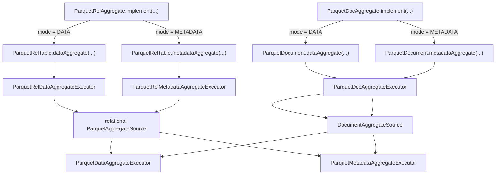
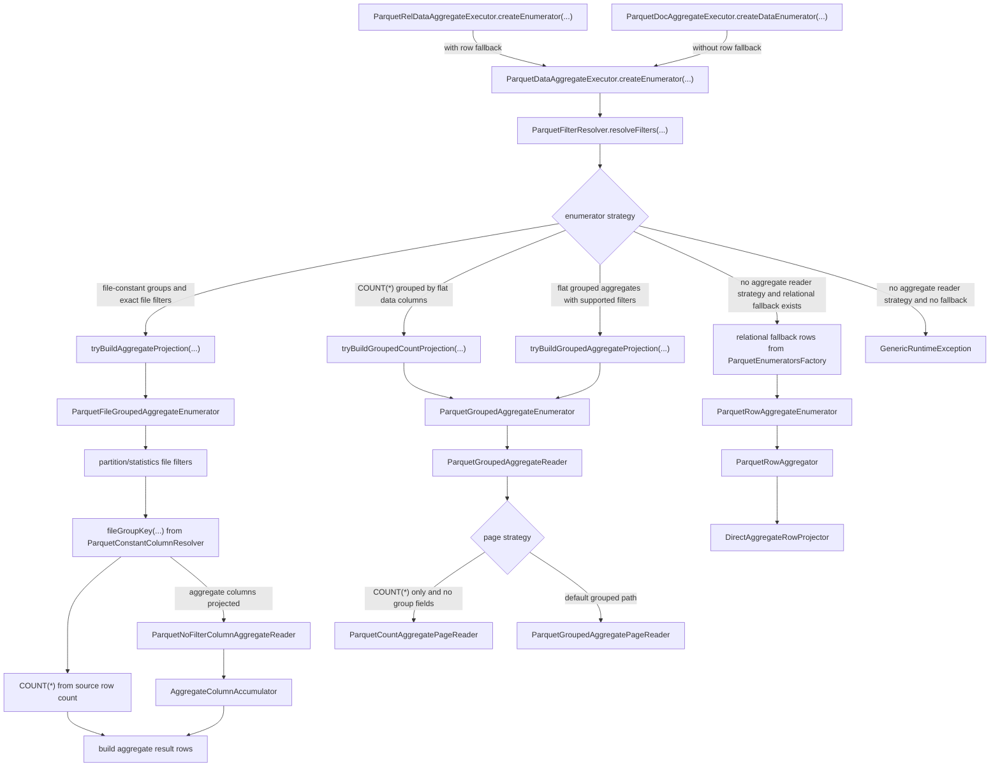
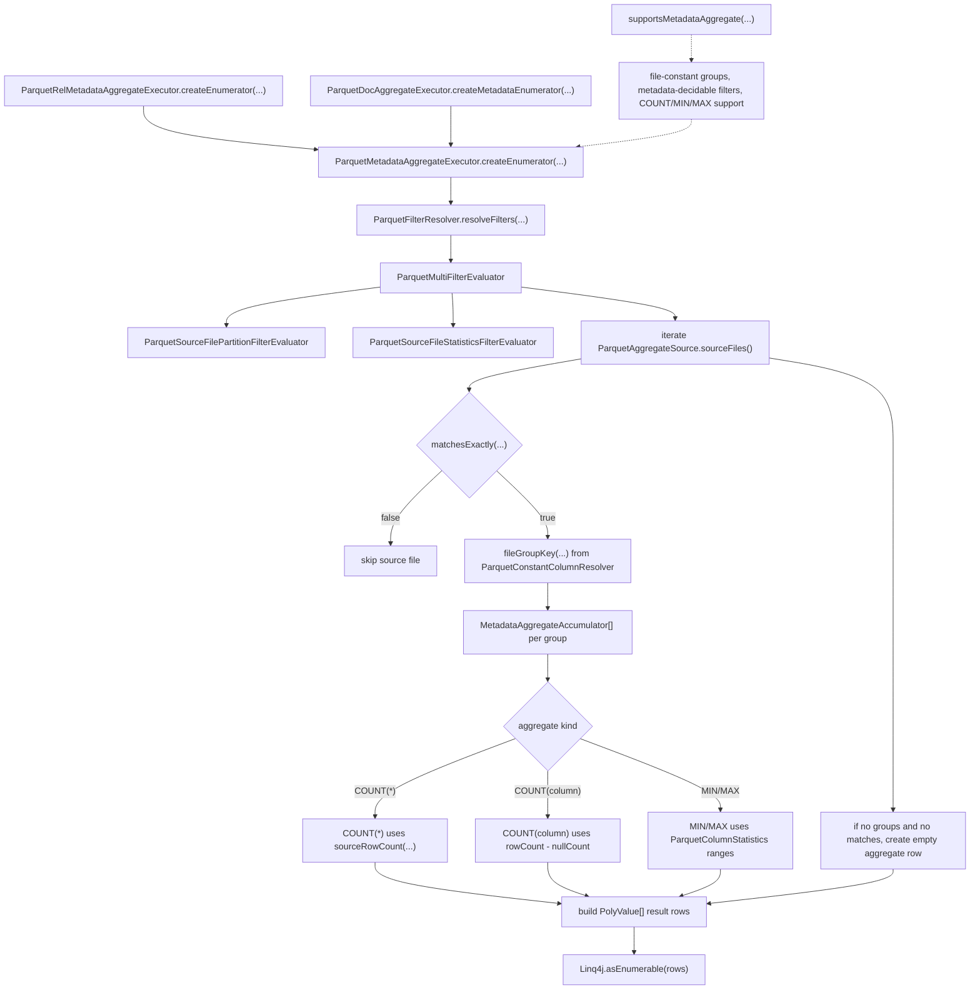
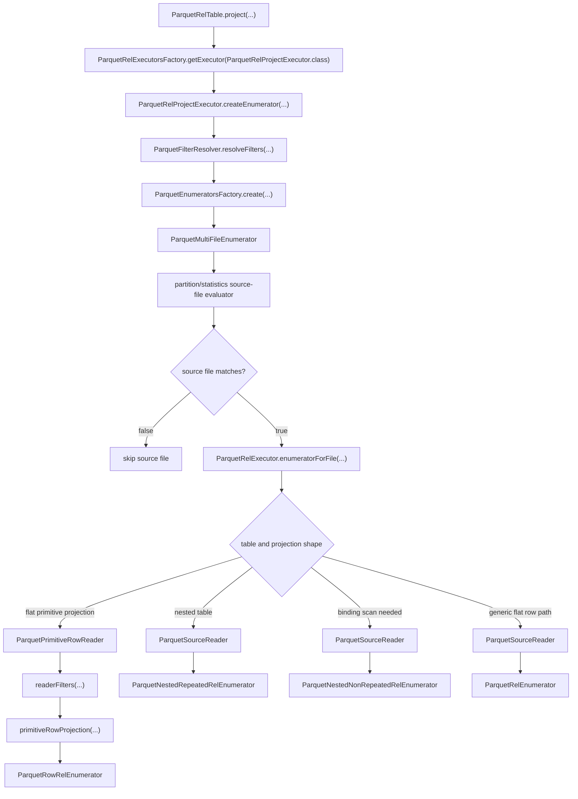
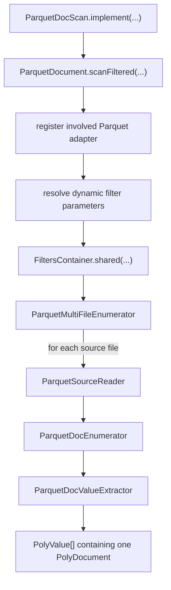
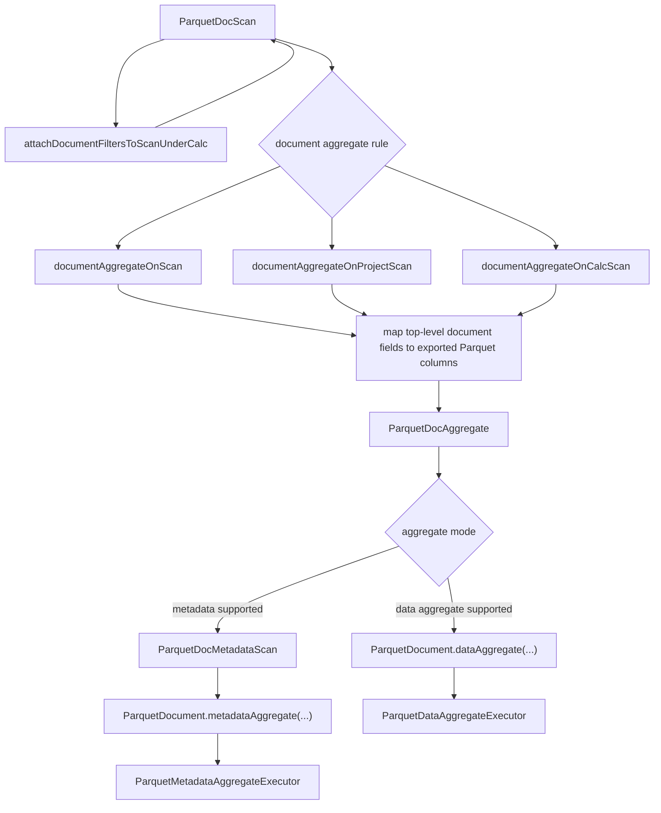

# Parquet Relational And Document Execution Flows

These diagrams describe the current Parquet runtime paths after aggregate
execution was moved into shared infrastructure and document aggregation pushdown
was added. They focus on runtime entry points reached from generated planner
nodes, not on full planner rule matching.

Relational execution starts at `ParquetRelTable`. Document execution starts at
`ParquetDocument`. Both models use the shared aggregate executors through the
`ParquetAggregateSource` abstraction.

## Aggregate Entry Points

## Shared Data Aggregate Flow

## Shared Metadata Aggregate Flow

## Relational Projection And Row Scan Flow

## Document Scan Flow

## Document Aggregate Planning To Runtime

## Notes

- Aggregate planner rules are registered only when
  `ParquetOptimizationSettings.isOptimizeAggregation()` is enabled.
- Metadata aggregation is exact-only. It requires file-constant group fields,
  metadata-decidable filters, and supported `COUNT`, `MIN`, or `MAX` aggregate
  calls.
- Data aggregation supports the shared fast paths for file-level aggregates,
  grouped counts, and grouped flat-column aggregates. The relational path also
  provides a row fallback; the document path relies on the shared aggregate
  readers.
- Document aggregate pushdown only maps projected top-level document fields that
  correspond to exported Parquet columns. More complex document expressions stay
  outside the adapter aggregate path.
