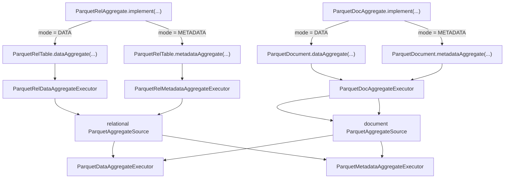
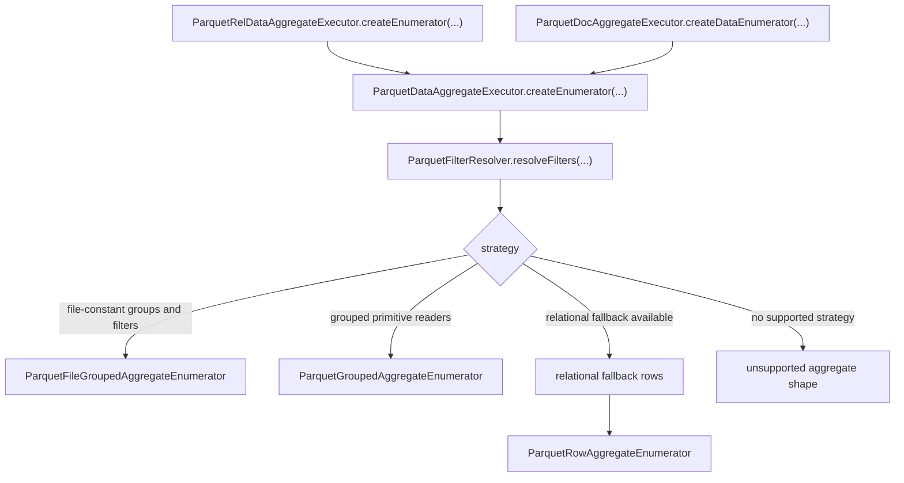
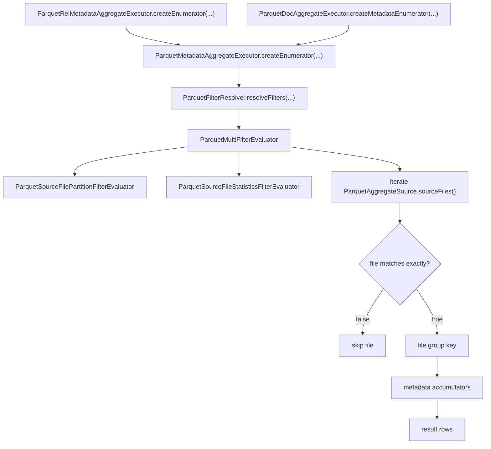
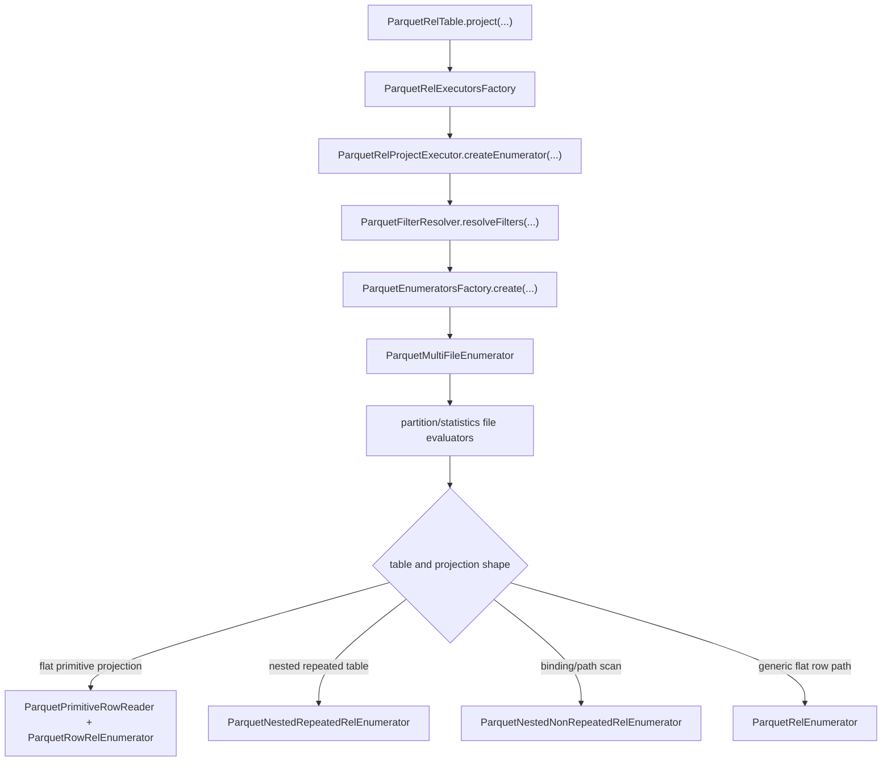
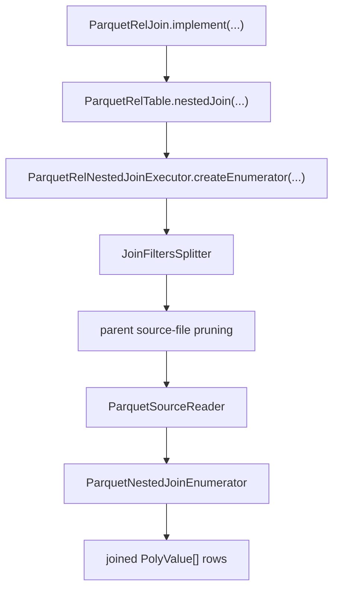
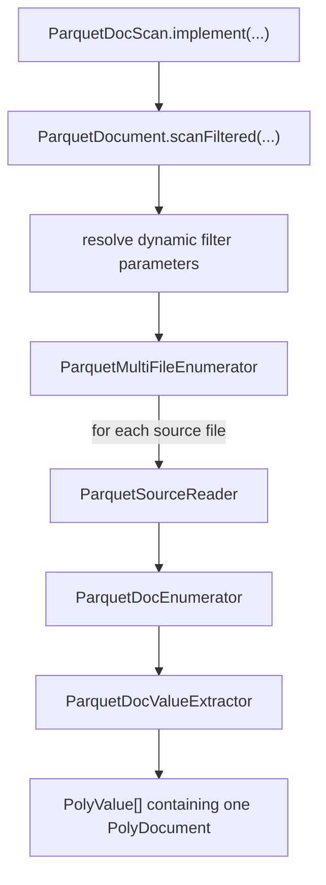

# Relational And Document Execution Flows

This document summarizes the current runtime entry points for relational scans,
document scans, structural joins, and aggregate execution.

## Aggregate Entry Points

## Data Aggregate Flow

## Metadata Aggregate Flow

## Relational Projection Flow

## Structural Join Flow

## Document Scan Flow

## Notes

- `ParquetRelTable` is the relational runtime facade for scans, joins, and
  aggregates.
- `ParquetDocument` is the document runtime facade for scans and aggregates.
- `ParquetSourceReader` is the low-level reader used after source-file pruning.
- `ParquetMultiFileEnumerator` handles file iteration and residual filter
  reduction for multi-file tables.
- Metadata aggregate execution is exact-only and uses partition values plus
  footer statistics.
- Data aggregate execution can use direct readers or relational row fallback,
  depending on the shape of the aggregate.
