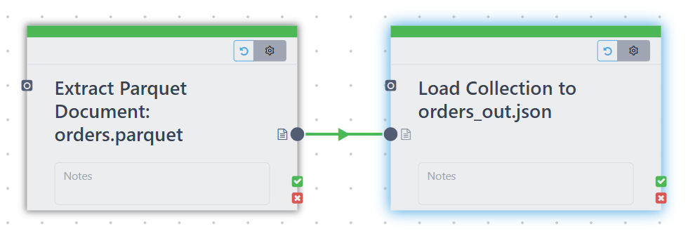
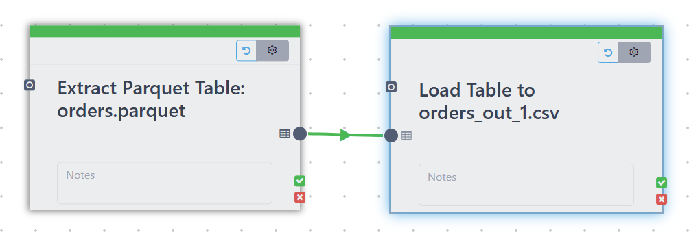
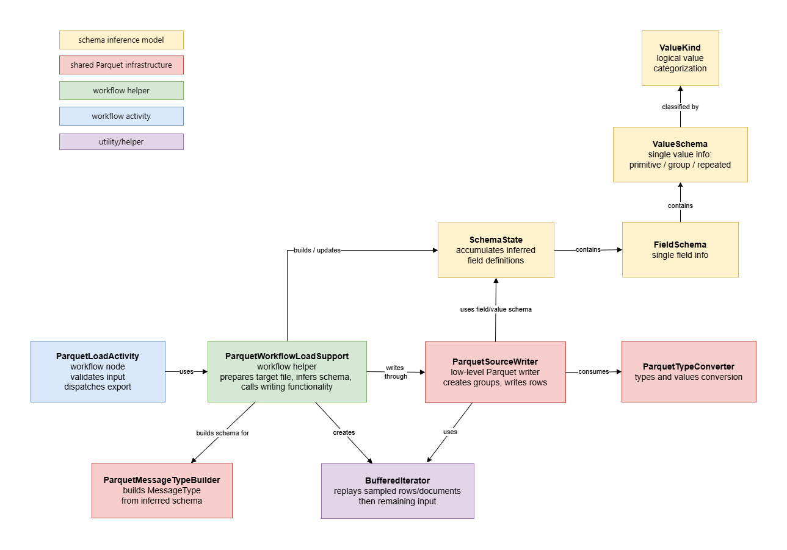

# WORKFLOW

---

## 1. Extract from Parquet file(s)

### GOAL
- read a parquet file
- convert data according to DOCUMENT / RELATIONAL workflow output model
- stream output to the workflow pipeline

### ACTIVITY SETTINGS

#### `file`
- Display name: `File Location`
- Type: file setting
- Required: yes
- Multiple values: yes
- Supported source types:
    - absolute file path
    - URL
- Purpose:
  Select one or more Parquet files, or a folder containing Parquet files, to extract from.
- Behavior:
  If multiple files are selected, the activity outputs the union of their rows.

#### `outputModel`
- Display name: `Output Type`
- Type: enum
- Required: yes
- Default: `document`
- Available values:
    - `document`
    - `relational`
- Purpose:
  Defines whether the extracted Parquet rows are exposed as workflow documents or as a relational table.

#### `nameField`
- Display name: `Add File Name Field`
- Type: boolean
- Required: no
- Default: `false`
- Purpose:
  Adds the source file name to the output.
- Behavior:
    - in document mode: adds a `fileName` field
    - in relational mode: adds a `fileName` column

#### `maxCount`
- Display name: `Maximum Row Count`
- Type: integer
- Required: no
- Default: `-1`
- Minimum: `-1`
- Group: advanced
- Purpose:
  Limits how many rows are extracted per file.
- Behavior:
    - `-1`: extract all rows
    - `>= 0`: extract at most that many rows from each selected file

#### ***Notes***

- The activity has no input ports and one output port of type `ANY`.
- The concrete output type is determined from `outputModel`.
- In relational mode, the schema is derived from the selected Parquet file or validated across all selected Parquet files if multiple relational sources are chosen.
- In document mode, the output is a document stream with generated document IDs where needed.
- Extract multiple files allowed only for Document model and Relational files with same schema

### CLASSES

- #### ParquetExtractActivity

`org.polypheny.db.workflow.dag.activities.impl.extract.ParquetExtractActivity`

Workflow node definition for reading Parquet files into a workflow output pipe:
1. It defines how the activity appears in the workflow UI using settings. This provides all needed information for editor to show options.
2. It decides what type of data the node will output: Relational or Document
3. It executes the extraction at runtime as follows: the activity resolves the input files, iterates over them, and delegates the actual reading/conversion work to `ParquetWorkflowExtractSupport.java`, which turns Parquet rows into either documents or relational rows and pushes them into the workflow output pipe.

- #### ParquetWorkflowExtractSupport

`org.polypheny.db.workflow.parquet.ParquetWorkflowExtractSupport`

Helper class contains Parquet extraction logic for the workflow engine.
It maps Parquet schemas to workflow output types, estimates row counts, generates dynamic activity names, and converts Parquet rows into either Polypheny documents or relational tuples.
Calls logic of Parquet Adapter Module

### FLOW

### 1. Activity entry and configuration

- The flow starts in `ParquetExtractActivity`

#### 1.1 Determine Output Model: DOCUMENT / RELATIONAL
- call `previewOutTypes(...)`

#### 1.2 Determine workflow-side Output Schema
- call `lockOutputType(...)`  
- ##### Make validations:
  - DOCUMENT
      - validate that source exists
      - no detailed field schema from the Parquet file needed
  - RELATIONAL
      - validate that source is a parquet file
      - for multiple source
          - `ParquetSourceReader.readSchema(source)` called to read source schemas
          - all source schemas are read and validated to ensure they are identical
          - once schema validation succeeds, the first source is used to build the relational output type
          - if relational sources do not share the same Parquet schema, preview fails.
- ##### Convert the Parquet schema into a workflow output type - `ParquetWorkflowExtractSupport.getOutputType(...)`
  - DOCUMENT - treat the output as a document stream with `_id`
  - RELATIONAL - a relational `AlgDataType` is built from the Parquet fields
    - call `ParquetFieldNameNormalizer` and `ParquetTypeConverter` functionality for field conversion

### 2. Determine Extraction flow: Document / Relational
- call `ParquetExtractActivity.pipe(...)` 
- Extraction delegated to `ParquetWorkflowExtractSupport`

### 3. DOCUMENT Extraction Flow
- call `ParquetWorkflowExtractSupport.writeDocuments(output, source, addNameField, maxCount)`

#### 3.1 Read parquet file data
- `ParquetSourceReader` created for the selected source. It:
  - opens Parquet file
  - reads rows as Parquet Group objects
  - exposes the projection schema
  - tracks the current row number

#### 3.2 Converting a row to a workflow document
- Each Parquet row is converted into a `PolyDocument` by `ParquetDocValueExtractor.extractDocument(...)`:
  - convert primitive values into Polypheny values
  - recursively converts nested groups into nested documents
  - converts repeated values into lists
  - synthesizes `_id` if needed. The generated `_id` uses:
    - source file name
    - current row number

#### 3.3 Optional file name column
- If `nameField = true`: the source file name is added as: `fileName`

#### 3.4 Writing to the workflow output pipe
- The converted document is passed to the workflow `OutputPipe`.

### 4. RELATIONAL Extraction Flow
- call `ParquetWorkflowExtractSupport.writeRows(output, source, addNameCol, maxCount)`

#### 4.1 Reader creation
- `ParquetSourceReader` created for the selected source.

#### 4.2 Reading rows
- loop over Parquet rows
- For each Parquet row, a workflow tuple is built as `List<PolyValue>`.

#### 4.3 Field conversion
- Each top-level field is converted using:`ParquetRelValueExtractor.extractValue(row, i, field)`:
  - nested Parquet structures are stored as PolyDocument
  - primitive values remain typed scalar columns

#### 4.4 Optional file name column
- If `nameField = true`: the file name is appended as an extra relational column

#### 4.5 Writing to the workflow output pipe
The relational tuple is passed to the workflow `OutputPipe`.

### 5. Multi-file behavior
- The activity supports multiple Parquet sources:
  - In document mode: multiple sources are always allowed, extracted documents are concatenated into one document stream
  - In relational mode: multiple sources are allowed only if they all share the same raw Parquet schema, schema equality is validated before execution

### 6. Row count estimation
- `estimateTupleCount(...)` gives the workflow engine a rough estimate of the output size, using Parquet metadata.

### TESTS:

- Read parquet file as Relational Data Source and store to CSV file
- Read parquet file as Document Data Source and store to JSON file
- Add file name as column
- Add key id column
- Set Maximum number of rows = 5 in Advanced settings
- Extract multiple documents
- Extract multiple relational - same schema
- Extract multiple relational - different schema - not allowed

 

---

## 2. Load to Parquet File

### GOAL
- read data from workflow pipeline
- convert data according to DOCUMENT / RELATIONAL inout type into Parquet format
- write output into Parquet file

### CLASS DIAGRAM

### ACTIVITY SETTINGS

#### `file`
- Display name: `Target File`
- Type: file setting
- Required: yes
- Multiple values: no
- Supported source types:
    - absolute file path
- Purpose:
  Select the Parquet file that should be written.

#### `mode`
- Display name: `Handling of Existing File`
- Type: enum
- Required: yes
- Default: `fail`
- Available values:
    - `drop`
    - `fail`
- Purpose:
  Defines the behavior if the selected output file already exists.
- Behavior:
    - `drop`: overwrite the existing file
    - `fail`: abort the activity

#### `compression`
- Display name: `Compression`
- Type: enum
- Required: yes
- Default: `snappy`
- Available values:
    - `snappy`
    - `gzip`
    - `uncompressed`
- Purpose:
  Selects the Parquet compression codec used for the generated file.

#### `schemaSampleSize`
- Display name: `Schema Sample Size`
- Type: integer
- Required: yes
- Default: `100`
- Minimum: `1`
- Purpose:
  Controls how many input tuples are sampled to infer the Parquet schema before writing starts.

#### `conflictMode`
- Display name: `Conflict Mode Handling`
- Type: enum
- Required: yes
- Default: `stringify`
- Available values:
    - `stringify`
    - `fail`
- Purpose:
  Defines how incompatible sampled values should be handled while inferring the Parquet schema.
- Behavior:
    - `stringify`: use a shared string field when incompatible sampled values are encountered
    - `fail`: abort the activity when sampled values are incompatible

#### `keepId`
- Display name: `Include ID Field`
- Type: boolean
- Required: no
- Default: `true`
- Purpose:
  Keeps the `_id` field when the activity receives document input.

#### `keepPk`
- Display name: `Keep Primary Key Column`
- Type: boolean
- Required: no
- Default: `false`
- Purpose:
  Keeps the workflow primary key column when the activity receives relational input.

#### ***Notes***

- The activity has one input port of type `ANY` and no output ports.
- Relational input and document input are both supported.
- Graph input is not supported.
- For relational input, the workflow primary key can optionally be excluded.
- For document input, the schema is inferred from sampled documents because the document type does not provide field-level schema information.

### CLASSES

- ### ParquetLoadActivity
`org.polypheny.db.workflow.dag.activities.impl.load.ParquetLoadActivity`

Workflow node definition for exporting workflow input into a Parquet file: 

1. It defines how the activity appears in the workflow UI using settings.
2. It validates whether the connected workflow input is supported.
3. It executes the export at runtime as follows:
    - the activity resolves the configured target file and export settings
    - prepares the output path
    - delegates the actual schema inference and data conversion work to `ParquetWorkflowLoadSupport.java`.
   

- ### ParquetWorkflowLoadSupport

`org.polypheny.db.workflow.parquet.ParquetWorkflowLoadSupport`

Helper class that contains Parquet export logic for the workflow engine.
It prepares output files, builds dynamic activity names, infers Parquet schema from sampled workflow input, maps workflow values to Parquet schema definitions, and delegates low-level file writing to the shared Parquet adapter module.

- ### _Parquet Writing Functionality_
- #### ParquetSourceWriter

`org.polypheny.db.adapter.parquet.shared.io.ParquetSourceWriter`

Shared low-level Parquet writer used by workflow export functionality.
It owns the Parquet writer lifecycle, creates Parquet row groups, writes rows to the target file, applies the configured compression codec, and exposes a small progress callback hook without depending on workflow-specific classes.

- #### ParquetMessageTypeBuilder

`org.polypheny.db.adapter.parquet.shared.schema.ParquetMessageTypeBuilder`

Builds a Parquet `MessageType` from inferred workflow field schemas, including primitive, repeated, and nested group fields.

- #### BufferedIterator

`org.polypheny.db.adapter.parquet.shared.execution.BufferedIterator`

Reusable iterator that replays sampled workflow tuples first and then continues with the remaining input iterator. It is used during Parquet export so sampled rows or documents are not lost after schema inference.

- ### _Schema Inference Model_
- ##### FieldSchema

`org.polypheny.db.adapter.parquet.shared.schema.inference.FieldSchema`

Internal model for one exported Parquet field. It tracks the source field name, normalized Parquet field name, optional relational source index, and inferred value schema.

- ##### ValueSchema
`org.polypheny.db.adapter.parquet.shared.schema.inference.ValueSchema`

Recursive internal model of a field value. It represents primitive values, nested groups, and repeated values before they are converted into a final Parquet schema.

- ##### ValueKind
`org.polypheny.db.adapter.parquet.shared.schema.inference.ValueKind`

Enum describing the logical value categories used during schema inference.

- ##### SchemaState
`org.polypheny.db.adapter.parquet.shared.schema.inference.SchemaState`

Container for the currently inferred schema during export. It accumulates field definitions while sampled rows or documents are inspected.

### FLOW

### 1. Entry Point - `ParquetLoadActivity.pipe(...)` 
- read settings
- `ParquetWorkflowLoadSupport.prepareTargetFile(...)` checks the output path
  - file not exists - continue
  - file exists and mode is `fail` - exception
  - file exists and mode is `drop` - delete file first
- `ActivityUtils.getDataModel(input.getType())` - determines the input data model using `ActivityUtils.getDataModel(input.getType())`
  - Possible cases:
    - DOCUMENT - continue with Document Input Flow
    - RELATIONAL - continue with Relational Input Flow
    - GRAPH - rejected, export to Parquet is not supported

### 2. Relational Input Flow - `ParquetWorkflowLoadSupport.writeRelational(...)` is called

##### 2.1 Initial schema setup from the Pipeline Type
- The input pipe already provides a relational `AlgDataType`. This type describes the exported workflow row structure. 
- A new `SchemaState` is created. This object is the mutable schema accumulator used during export. 
- The first schema shape is initialized from the pipeline type by calling: `schemaState.init(inputType, keepPk)`
  - creates one `FieldSchema` for every exported column
  - assigns an initial `ValueSchema` to each field from the declared Polypheny type
- **_At this point, schema information comes from the pipeline type itself._**

##### 2.2 Refine the schema using sampling rows
- After initialization, the exporter samples the first `schemaSampleSize` rows from the input iterator.
- Each sampled row is:
  - stored in memory 
  - merged into the schema state using `schemaState.mergeRelationalRowSchema(row, inputType, keepPk)`
- Runtime values may contain more information than the declared relational type. ***For example:***
  - the pipeline says a column is TEXT, but the actual data is numeric
  - one field may hold a list/array rather than a single scalar value - parquet field should be modeled as a repeated field
  - values may conflict across rows
- While sampling, each field value is converted into an inferred `ValueSchema` and merged with the existing field schema.

##### 2.3 Conflict Handling   
If sampled values for the same field are incompatible, the behavior depends on `conflictMode`. Two modes exist:
- `stringify`
  - incompatible values are collapsed to `ValueSchema.stringType()`
  - that field will be written as a Parquet string column
- `fail`
  - schema inference throws an exception
  - export stops before the file is written

#### 2.4 Final Parquet schema creation

The final Parquet schema  `MessageType` is built from the accumulated `SchemaState`: `new ParquetMessageTypeBuilder(schemaState, SCHEMA_NAME).build()`
- The schema builder converts each inferred `FieldSchema` and `ValueSchema` into Parquet schema elements:
  - primitive fields become primitive Parquet columns
  - repeated values become repeated Parquet fields (list)
  - nested structures become Parquet groups

#### 2.5 Combine sampled rows and remaining input under same Iterator

- The sampled rows were already consumed from the input iterator during inference, so they must not be lost.
- To solve this produce one continuous iterator `BufferedIterator`:
  - first the sampled rows are replayed
  - then the remaining pipeline rows are read normally

#### 2.6 Writing
- The actual Parquet file writing is delegated to `ParquetSourceWriter`
- `ParquetSourceWriter.writeRows(...)` iterates over all rows and writes them one by one
- For each relational row:
  - a new empty Parquet `Group` is created from the final schema
  - `populateGroupWithRelationalRow(...)` iterates over all exported `FieldSchema`s
  - for each field, the source row value is taken using `sourceIndex`
  - the value is written into the Parquet group using `populateGroupWithValue(...)`

- Then:
  - repeated values go through `populateGroupWithRepeatedValue(...)`
  - single values go through `populateGroupWithSingleValue(...)`
  - primitive values are handled by `addPrimitiveValue(...)` - final conversion from `PolyValue` to a Parquet-compatible primitive value

### 3. Document Input Flow - `ParquetWorkflowLoadSupport.writeDocuments(...)` is called

- No field-level schema comes from the pipeline. 
- ***Schema inference is mandatory*** for document export.

#### 3.2 Sampling documents
- Read the first `schemaSampleSize` documents from the input pipe
- Each sampled document is:
  - buffered in memory
  - merged into the schema state using `schemaState.mergeDocumentSchema(document, keepId)`

#### 3.3 Handling nested fields and repeated values
- Document schema inference supports:
  - primitive fields
  - nested documents - Nested documents become `ValueSchema` of kind `GROUP`
  - repeated values / lists - Lists become repeated `ValueSchema`
  

- If sampled documents contain incompatible shapes for the same field:
  - `conflictMode = stringify` collapses the field to string
  - `conflictMode = fail` aborts the export

#### 3.4 Final Parquet schema creation
- The accumulated schema state is converted into a Parquet `MessageType` using `ParquetMessageTypeBuilder`.

#### 3.5 Combine sampled rows and remaining input under same Iterator
- Sampled documents are wrapped together with the remaining input using `BufferedIterator`, so sampled documents are written first and the rest of the pipeline continues after them.

#### 3.6 Writing

- `ParquetSourceWriter`is created

- For each document:
  - a new empty Parquet `Group` is created
  - `populateGroupWithDocument(...)` iterates through all inferred fields 
  - each field value is searched in the input document by `sourceName`
  - values are written recursively into the Parquet group
  

- Nested document fields are written as nested groups.
- Repeated values are written as repeated Parquet fields or repeated groups.
- Primitive values are converted through `addPrimitiveValue(...)`.

### 4. Progress reporting

Workflow progress is not handled inside the schema builder or the activity itself. It is handled during row writing through the callback passed to `ParquetSourceWriter.writeRows(...)`.

### TESTS:

- Read relational workflow input and export to Parquet file
- Read document workflow input and export to Parquet file
- Keep `_id` for document export
- Keep workflow primary key for relational export
- Write with different compression codecs
- Use `schemaSampleSize = 5`
- Export incompatible sampled values with `conflictMode = stringify`
- Fail export on incompatible sampled values with `conflictMode = fail`

---

## Unit Tests

