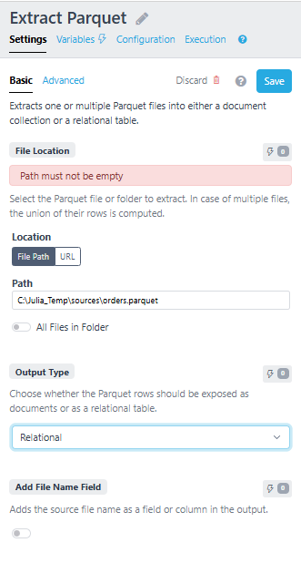
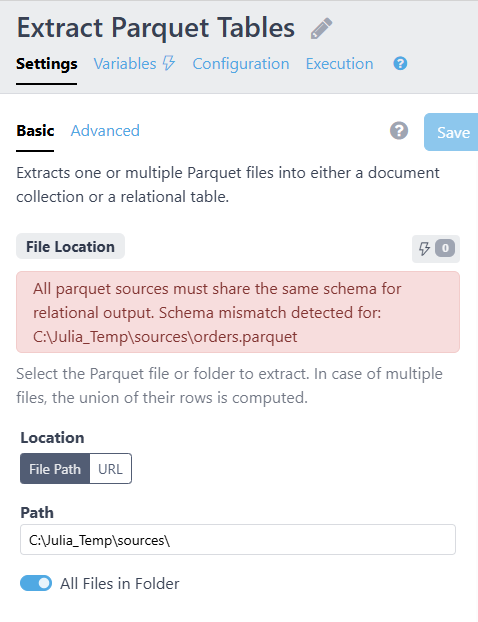
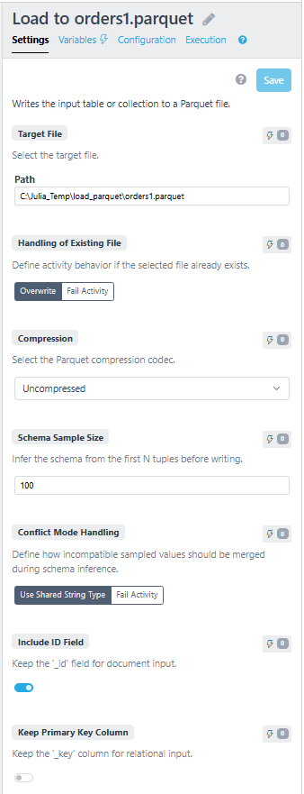
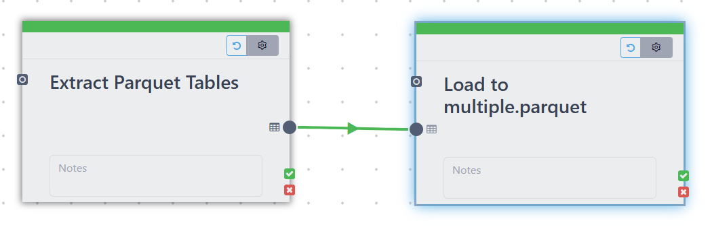

# Workflow Integration

The workflow engine provides Parquet extract and load activities. The activities
live in `plugins/workflow-engine`, while the low-level reader/writer and schema
conversion utilities are shared with `plugins/parquet-adapter`.

## Extract Parquet

Activity class:

```text
org.polypheny.db.workflow.dag.activities.impl.extract.ParquetExtractActivity
```

Support class:

```text
org.polypheny.db.workflow.parquet.ParquetWorkflowExtractSupport
```

The activity reads one or more Parquet files and emits either documents or
relational rows.

### Settings

| Key | Meaning |
| --- | --- |
| `file` | One or more absolute files, URLs, or folders containing Parquet files |
| `outputModel` | `document` or `relational` |
| `nameField` | Adds the source file name as `fileName` |
| `maxCount` | Maximum rows per selected file; `-1` means no limit |

### Output Type Preview

Document output:

- no field-level schema is required
- if `nameField` is enabled, the preview exposes `fileName`

Relational output:

- schema is read from the selected Parquet source
- multiple selected sources must expose compatible raw Parquet schemas
- field names are normalized by `ParquetNameNormalizer`
- field types are mapped by `ParquetTypeConverter`

### Document Extraction Flow

1. `ParquetExtractActivity.pipe(...)` resolves selected sources.
2. `ParquetWorkflowExtractSupport.writeDocuments(...)` opens a
   `ParquetSourceReader` for each source.
3. `ParquetDocValueExtractor.extractDocument(...)` converts each Parquet
   `Group` into a `PolyDocument`.
4. Missing document ids are generated from source file and row number.
5. `fileName` is added when `nameField` is enabled.
6. Documents are written to the workflow `OutputPipe`.

### Relational Extraction Flow

1. `ParquetWorkflowExtractSupport.writeRows(...)` opens a `ParquetSourceReader`.
2. Each Parquet row is converted to a `List<PolyValue>`.
3. `ParquetRelValueExtractor` converts primitive and structured values.
4. Nested Parquet structures that remain in flat relational output are returned
   as document-like values.
5. `fileName` is appended when `nameField` is enabled.
6. Rows are written to the workflow `OutputPipe`.

## Load To Parquet

Activity class:

```text
org.polypheny.db.workflow.dag.activities.impl.load.ParquetLoadActivity
```

Support class:

```text
org.polypheny.db.workflow.parquet.ParquetWorkflowLoadSupport
```

The activity writes relational or document workflow input to a Parquet file.
Graph input is rejected.

### Settings

| Key | Meaning |
| --- | --- |
| `file` | Target absolute file path |
| `mode` | `drop` overwrites an existing file, `fail` rejects it |
| `compression` | `snappy`, `gzip`, or `uncompressed` |
| `schemaSampleSize` | Number of input tuples sampled for schema inference |
| `conflictMode` | `stringify` or `fail` for incompatible sampled values |
| `keepId` | Include document `_id` field when writing documents |
| `keepPk` | Include workflow primary-key column when writing relational rows |

### Shared Writer Classes

Low-level shared classes:

- `ParquetSourceWriter`
- `ParquetMessageTypeBuilder`
- `BufferedIterator`
- `SchemaState`
- `FieldSchema`
- `ValueSchema`
- `ValueKind`

### Relational Export Flow

1. `ParquetLoadActivity.pipe(...)` reads settings and validates the input model.
2. `ParquetWorkflowLoadSupport.prepareTargetFile(...)` handles existing-file
   behavior.
3. `SchemaState.init(inputType, keepPk)` creates initial fields from the
   relational input type.
4. The first `schemaSampleSize` rows are sampled and merged into the schema
   state with `mergeRelationalRowSchema(...)`.
5. `conflictMode` decides whether incompatible sampled values become strings or
   fail the activity.
6. `ParquetMessageTypeBuilder` builds the final Parquet `MessageType`.
7. `BufferedIterator` replays sampled rows before the remaining input rows so no
   sampled data is lost.
8. `ParquetSourceWriter.writeRows(...)` writes rows to the target file and
   reports progress through the workflow callback.

### Document Export Flow

1. Document input has no fixed field schema, so sampling is mandatory.
2. Sampled documents are merged with `SchemaState.mergeDocumentSchema(...)`.
3. Nested documents become Parquet groups.
4. Lists become repeated Parquet fields or repeated groups.
5. `keepId` controls whether `_id` participates in schema inference and output.
6. `ParquetSourceWriter.writeDocuments(...)` writes the final file.

## Validation And Limitations

- Graph input is not supported for Parquet export.
- Relational export rejects an input with only the workflow primary-key column
  when `keepPk` is false.
- Document export rejects an empty inferred schema.
- Multiple relational extract sources must have compatible schemas.
- Progress is reported during row/document writing, not during schema
  inference.

## Supporting Images

The following images are kept as UI/reference screenshots:








